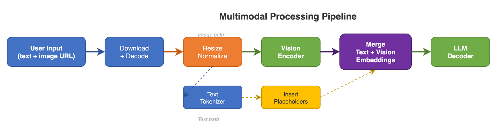

# 10 - Advanced Features

vLLM isn't just a fast text generator — it comes packed with advanced features that let you customize models, handle images and audio, speed up generation, and control output format. This page walks through each one in plain language.

---

## LoRA (Low-Rank Adaptation)


### What is it?

Fine-tuning a large language model usually means updating billions of parameters — that's expensive, slow, and requires a lot of GPU memory. **LoRA** is a shortcut. Instead of changing the entire model, you freeze the original weights and attach tiny "adapter" layers on top. These adapters have far fewer parameters (often less than 1% of the original model), so they're cheap to train and store.

Think of it like this: instead of remodeling your entire house to change the style, you just swap out the curtains and throw pillows. The structure stays the same, but the feel is different.

### Why does it matter?

- **Cost**: You can fine-tune a model for your specific use case without needing massive GPU resources.
- **Multi-tenant serving**: vLLM can load multiple LoRA adapters at the same time and route different requests to different adapters. One base model, many customizations — all served simultaneously.
- **Hot-swapping**: Adapters can be loaded and unloaded at runtime via the API, without restarting the server.

Mathematically, LoRA works by adding a low-rank update: `W_new = W_base + alpha * (B @ A)` where A and B are small matrices. But you don't need to understand the math to use it.

| Feature | Detail |
|---------|--------|
| Dynamic loading | Load/unload adapters at runtime via API |
| Multi-LoRA | Serve multiple LoRA adapters simultaneously |
| Batched LoRA | Different requests can use different adapters |
| Punica | Efficient batched LoRA computation kernel |
| Max LoRA rank | Configurable (default: 16) |

```bash
vllm serve base-model --lora-modules lora1=path1 lora2=path2
```

### Under the Hood: Rank, Alpha, and Target Layers

**Rank** determines the size of the adapter matrices. For a weight matrix `W` of size `[d x d]`:
- LoRA adds two small matrices: `A` (size `[d x r]`) and `B` (size `[r x d]`)
- The rank `r` is typically 8, 16, or 32 -- much smaller than `d` (which can be 4096 or 8192)
- Memory per adapter: `2 x d x r x dtype_size` per layer

**Alpha** is a scaling factor that controls how strongly the adapter modifies the base model. The effective update is `(alpha / rank) * B @ A`. Common values: alpha = 16 when rank = 16 (so the scaling factor is 1.0).

**Which layers get adapters?** Not all layers need LoRA. The most common targets are:
- `q_proj`, `k_proj`, `v_proj` (attention query/key/value projections)
- `o_proj` (attention output projection)
- `gate_proj`, `up_proj`, `down_proj` (MLP layers)

For Llama-3.1-8B with rank=16 targeting all attention + MLP layers:
- Per-adapter memory: ~50-100 MB (vs 16 GB for the full model)
- You can easily serve 20-50 different LoRA adapters simultaneously

### The Punica Kernel

When serving multiple LoRA adapters in the same batch, each request might use a different adapter. Naive implementation would require separate GEMM operations for each adapter. The **Punica kernel** (`vllm/lora/punica_wrapper/`) solves this with a batched LoRA computation:

```python
# From vllm/lora/punica_wrapper/punica_base.py
# Based on: Chen et al., "Punica: Multi-Tenant LoRA Serving" (2023)
class PunicaWrapperABC(ABC):
    def add_shrink(self, y, x, lora_a_stacked, scale):
        """Batched GEMM for lora_a across multiple adapters"""
        ...

    def add_expand(self, y, x, lora_b_stacked, add_input):
        """Batched GEMM for lora_b across multiple adapters"""
        ...
```

Punica uses custom Triton kernels (`vllm/lora/ops/triton_ops/`) to fuse the LoRA computations for all requests in a batch into a single kernel launch, regardless of how many different adapters are active. This makes multi-LoRA serving nearly as fast as serving the base model alone.

---

## Multimodal Support

### What is it?

Most people think of LLMs as text-in, text-out. But modern models can process **images, audio, and video** too. vLLM supports these **multimodal** models, so you can send a photo and ask "What's in this image?" or send an audio clip and get a transcription.

### Why does it matter?

- **Richer applications**: Build chatbots that understand screenshots, analyze medical images, or process voice commands.
- **Unified serving**: Instead of running separate models for text, vision, and audio, you can serve one multimodal model that handles all of them through the same API.

### Supported Modalities

| Modality | Models | Input Format |
|----------|--------|-------------|
| Images | LLaVA, Qwen-VL, InternVL, Phi3-V | PIL Image, URL, base64 |
| Video | LLaVA-Next-Video | Video frames |
| Audio | Qwen2-Audio, Whisper | Audio arrays |
| Mixed | Many vision-language models | Text + images/video |

### How It Works Under the Hood



When you send an image (or audio, or video) to vLLM, here's what happens step by step:

| Step | Action |
|------|--------|
| 1 | Receive multimodal input (image URL, base64, etc.) |
| 2 | `MultiModalProcessor` downloads/decodes the media |
| 3 | Resize, normalize, and create a `pixel_values` tensor (a number grid the model can understand) |
| 4 | Insert placeholder tokens in the text prompt where the media belongs |
| 5 | Model runs its forward pass with a vision/audio encoder alongside the language model |

The key insight: the model's text part still works normally. The vision or audio encoder just converts the media into "tokens" that the language model can reason about, as if they were words.

---

## Speculative Decoding

### What is it?

Normally, a language model generates tokens one at a time — each token requires a full forward pass through the model. For a large model, each pass is slow. **Speculative decoding** is like having a fast rough-draft writer and a careful editor working together:

1. A **small, fast "draft" model** quickly proposes several tokens (say, 5 at a time).
2. The **large "target" model** checks all 5 tokens in a single forward pass (this is much cheaper than running 5 separate passes).
3. If the draft tokens match what the target model would have generated, they're accepted — that's free speedup!
4. If a draft token is wrong, the target model corrects it from that point and generation continues.

### Why does it matter?

- **Speed**: You can get 2-3x faster generation with no loss in output quality. The final output is statistically identical to what the large model would have produced alone.
- **Free lunch**: Unlike other speedup techniques that sacrifice accuracy, speculative decoding gives you the exact same output distribution — just faster.


### Under the Hood: Acceptance Probability and Rejection Sampling

The core algorithm follows the paper ["Fast Inference from Transformers via Speculative Decoding"](https://arxiv.org/abs/2211.17192). The implementation is in `vllm/v1/sample/rejection_sampler.py`:

```python
# From vllm/v1/sample/rejection_sampler.py
class RejectionSampler(nn.Module):
    """
    accepted tokens: tokens accepted based on draft vs target probabilities.
    recovered tokens: sampled from adjusted probability distribution
        (derived from both draft and target probabilities).
    bonus tokens: if all proposed tokens are accepted, a bonus token
        is added (sampled from target probabilities only).
    output tokens = accepted tokens + recovered tokens + bonus tokens
    """
```

**How acceptance works for each draft token:**
1. Compare draft probability `q(x)` with target probability `p(x)` for the proposed token `x`
2. Accept with probability `min(1, p(x) / q(x))`
3. If rejected, sample a "recovered" token from the adjusted distribution `max(0, p(x) - q(x))`

**Key insight**: If the draft model is good (its distribution `q` is close to target `p`), most tokens get accepted. If it is poor, tokens get rejected early and you waste the draft computation.

### How Many Draft Tokens to Use

The `num_speculative_tokens` parameter (typically 3-5) controls how many draft tokens are proposed per step:

| Draft Tokens | Typical Accept Rate | Effective Speedup | When to Use |
|-------------|--------------------|--------------------|-------------|
| 1 | 80-95% | 1.3-1.5x | Conservative, always safe |
| 3 | 60-85% | 1.5-2.0x | Good default |
| 5 | 40-70% | 1.5-2.5x | When draft model is very aligned |
| 7+ | 30-60% | Diminishing returns | Only with Eagle/MTP |

**When speculative decoding helps:**
- Large target model (70B+) with a good small draft model (1-7B)
- Predictable text (code completion, templated output)
- Batch size of 1 (latency-sensitive, single-user scenarios)

**When it hurts:**
- Small target model (7-8B) -- the overhead of running the draft model is not worth it
- High batch sizes -- the target model is already well-utilized
- Very creative/random text (low temperature, high entropy) -- acceptance rate drops

```bash
# Use a draft model for speculative decoding
vllm serve meta-llama/Llama-3.1-70B \
  --speculative-model meta-llama/Llama-3.2-1B \
  --num-speculative-tokens 5

# Use Eagle (learned draft head, no separate model needed)
vllm serve meta-llama/Llama-3.1-70B \
  --speculative-model eagle-model-path \
  --speculative-method eagle
```

### Methods

Different approaches to generating those "draft" tokens:

| Method | How It Works |
|--------|-------------|
| Draft Model | A separate, smaller model proposes tokens — simple and effective |
| Eagle | A learned "draft head" attached to the target model itself — no separate model needed |
| Medusa | Multiple parallel draft heads that each predict a different future position |
| MTP (Multi-Token Prediction) | The model is trained to natively predict multiple tokens at once |

---

## Tool / Function Calling

### What is it?

Language models are great at generating text, but they can't actually do math, check the weather, or query a database. **Tool calling** lets the model say "I need to call a function" instead of making up an answer. The model outputs a structured function call, your application executes it, and feeds the result back.

Think of it like a student who's allowed to use a calculator during an exam — instead of guessing at arithmetic, they use the right tool for the job.

### Why does it matter?

- **Accuracy**: The model uses a real calculator instead of guessing that 1,847 x 293 = "something around 540,000."
- **Real-time data**: The model can fetch live weather, stock prices, or database records instead of relying on its training data.
- **Agentic workflows**: Tool calling is the foundation for AI agents that can take actions — book flights, send emails, run code, etc.

```json
{
  "tools": [{
    "type": "function",
    "function": {
      "name": "get_weather",
      "parameters": {"type": "object", "properties": {"city": {"type": "string"}}}
    }
  }],
  "tool_choice": "auto"
}
```

### Under the Hood: How Tool Parsers Work

Each model family formats tool calls differently in its output. vLLM's tool parser system (`vllm/tool_parsers/`) handles this diversity:

```python
# From vllm/tool_parsers/abstract_tool_parser.py
class ToolParser:
    """Abstract ToolParser class."""
    def __init__(self, tokenizer):
        self.prev_tool_call_arr: list[dict] = []
        self.current_tool_id: int = -1
        self.streamed_args_for_tool: list[str] = []

    def adjust_request(self, request):
        """Add structured output constraints for tool calling."""
        json_schema = get_json_schema_from_tools(request.tool_choice, request.tools)
        if json_schema is not None:
            request.structured_outputs = StructuredOutputsParams(json=json_schema)
```

**Key insight**: Many tool parsers use **structured outputs** (JSON schema constraints) under the hood. When you pass `tools` to the API, the parser converts the tool definitions into a JSON schema and constrains the model's output to match. This means the model can only generate valid tool call JSON.

### Supported Parsers (30+)

vLLM supports tool calling with a wide range of model formats, including:

OpenAI, Mistral, Llama3, Llama4, Qwen3, DeepSeek, Hermes, xLAM, Pythonic, and many more.

Each model family has its own way of formatting tool calls in the output, and vLLM's parsers handle the differences so you get a consistent API.

### Writing a Custom Tool Parser

If your model uses a unique tool call format, you can write a custom parser:

1. Subclass `ToolParser` from `vllm/tool_parsers/abstract_tool_parser.py`
2. Implement `extract_tool_calls(model_output, request)` to parse the model's output into `ExtractedToolCallInformation`
3. Implement `extract_tool_calls_streaming(...)` for streaming support
4. Register it: `ToolParserManager.register_module("my_parser", MyToolParser)`
5. Use it: `vllm serve model --tool-call-parser my_parser`

---

## Structured Outputs

### What is it?

By default, a language model can output any text — including malformed JSON, missing fields, or random prose when you wanted data. **Structured outputs** constrain the model to produce only valid output that matches a schema you define. If you need valid JSON with specific fields, the model is forced to produce exactly that.

Think of it like a fill-in-the-blank form versus a blank sheet of paper. The form guarantees you get the fields you need in the right format.

### Why does it matter?

- **Reliability**: Your downstream code can parse the output without try/catch gymnastics or retry loops.
- **Integration**: When building pipelines (model output → database, model output → API call), structured output means you can trust the format every time.

```python
# JSON schema constraint
response = client.chat.completions.create(
    model="model",
    messages=[...],
    extra_body={"guided_json": {"type": "object", "properties": {...}}}
)
```

### Under the Hood: xgrammar vs guidance

| Backend | Method | Pros | Cons |
|---------|--------|------|------|
| **xgrammar** (default) | Compiles a grammar from the JSON schema, then generates a bitmask at each step that masks out tokens violating the grammar | Fast (C++ implementation), low overhead per token | Limited to JSON/regex schemas |
| **guidance** | Uses a more flexible grammar engine that supports complex structured output patterns | More expressive, supports more complex patterns | Slower per-token overhead |

**How it works at token level:**

1. Before generation starts, the backend compiles your JSON schema into a grammar (a set of rules about what characters can appear where)
2. At each generation step, the backend computes a **bitmask** over the vocabulary -- marking which tokens are valid given the current partial output
3. The bitmask is applied to the model's logits before sampling, making it impossible to generate tokens that would break the schema
4. This adds minimal latency (~0.1 ms per step) because the grammar state machine is fast

```bash
# Use xgrammar (default)
vllm serve model --guided-decoding-backend xgrammar

# Use guidance
vllm serve model --guided-decoding-backend guidance
```

These backends work by modifying the model's token probabilities at each step, making it impossible to generate tokens that would break the schema. It's like autocomplete that only suggests valid next characters.

---

## Reasoning / Thinking

### What is it?

Some models (like DeepSeek-R1 and Qwen3) are trained to **think step-by-step** before giving a final answer. When you enable "thinking mode," the model first writes out its reasoning process (like showing work on a math problem), then gives the final answer.

### Why does it matter?

- **Better answers**: For complex math, logic, and coding problems, step-by-step reasoning dramatically improves accuracy.
- **Transparency**: You can see *how* the model arrived at its answer, making it easier to spot mistakes or understand the logic.

```json
{
  "messages": [{"role": "user", "content": "Solve x^2 = 4"}],
  "extra_body": {"chat_template_kwargs": {"enable_thinking": true}}
}
```

The response includes `reasoning_content` (the step-by-step thinking) alongside `content` (the final answer). Your application can choose to show both, or just the final answer.

---

## Prefix Caching

Shared system prompts like *"You are a helpful assistant..."* are cached in KV blocks and reused across all requests. If 100 users have the same system prompt, the KV cache for that prompt is computed once and shared — a massive speedup. Cache hit rate is tracked in scheduler stats. See [Scheduling & KV Cache](SCHEDULING-KV-CACHE) for the full prefix caching diagram and detailed explanation.

---

## Disaggregated Prefill

### What is it?

For very long prompts, the initial computation (prefill) can be separated from token generation (decode) and run on different machines. This is like having a **prep kitchen** that does all the chopping and a **service kitchen** that does the plating — each optimized for its task.

- A **Prefill Node** (GPU-rich, optimized for compute) processes the long prompt and computes the KV cache.
- The KV cache is transferred via NIXL/LMCache to a **Decode Node** (memory-rich, optimized for throughput).
- The Decode Node generates tokens using the transferred KV cache.

### Why Disaggregate?

Prefill is **compute-bound** (GPU cores doing heavy matrix math), while decode is **memory-bound** (reading large KV caches). Running both on the same GPU means neither phase gets optimal hardware. Separation lets you tune each independently:

- Prefill nodes: more TP, larger GPUs, optimized for TTFT
- Decode nodes: more memory, higher batch sizes, optimized for ITL

> **Important**: Disaggregated prefilling improves latency characteristics (lower TTFT and ITL), but does NOT improve total throughput. See the [official docs](https://docs.vllm.ai/en/latest/features/disagg_prefill.html).

### vLLM's Implementation (Experimental)

vLLM supports disaggregated prefill as an **experimental feature** using KV cache transfer connectors:

- **NIXL Connector**: High-performance RDMA-based transfer
- **LMCache Connector**: Cache-based KV transfer
- **P2P NCCL Connector**: Direct GPU-to-GPU transfer
- **vLLM Router** (released Dec 2025): Prefill/decode-aware load balancer with session affinity

```bash
# Example: Run prefill and decode on separate instances
# See docs.vllm.ai/en/latest/examples/online_serving/disaggregated_serving/
```

### How Does NVIDIA Dynamo Compare?

[NVIDIA Dynamo](https://docs.nvidia.com/dynamo/latest/architecture/disagg_serving.html) is a production-grade framework that takes disaggregated serving further:

| Aspect | vLLM (Experimental) | [NVIDIA Dynamo](https://docs.nvidia.com/dynamo/latest/) |
|--------|---------------------|-----------------|
| Prefill/Decode separation | Yes | Yes |
| KV cache transfer | NIXL, LMCache, P2P | RDMA-based, optimized |
| **Conditional disaggregation** | No (always remote) | **Yes** (smart runtime decision: local vs remote based on queue depth) |
| Router intelligence | vLLM Router (basic) | Disaggregated router with queue-aware routing |
| Independent scaling | Manual config | **Auto-scaling** prefill and decode pools independently |
| Maturity | Experimental | Production framework |

**Key Dynamo advantage**: [Conditional disaggregation](https://docs.nvidia.com/dynamo/latest/design_docs/disagg_serving.html) — Dynamo intelligently decides at runtime whether a request's prefill should run locally or be sent to a remote prefill worker, based on the prefill length and current queue status. Short prompts stay local (avoiding transfer overhead), while long prompts get sent to dedicated prefill nodes.

**Read more about NVIDIA Dynamo**:
- [Dynamo Architecture](https://docs.nvidia.com/dynamo/latest/architecture/disagg_serving.html)
- [Dynamo Performance Tuning](https://docs.nvidia.com/dynamo/latest/performance/tuning.html)
- [Dynamo + llm-d Community](https://developer.nvidia.com/blog/nvidia-dynamo-accelerates-llm-d-community-initiatives-for-advancing-large-scale-distributed-inference/)

---

## Sleep Mode

For reinforcement learning (RL) training workflows where the same GPU needs to alternate between serving inference and training:

1. Engine serves inference as usual.
2. `sleep()` is called — GPU memory is freed, making room for training.
3. Training updates the model weights.
4. `wake()` reloads the updated weights and resumes serving.

This avoids the need for separate inference and training GPU clusters, saving significant hardware costs.

---

## Feature Compatibility Matrix

Not all features work together. Here is what you can combine:

| Feature | + LoRA | + Spec Decode | + Structured Output | + Tool Calling | + Multimodal |
|---------|--------|--------------|--------------------|--------------|--------------| 
| LoRA | -- | No | Yes | Yes | Limited |
| Spec Decode | No | -- | Limited | Yes | No |
| Structured Output | Yes | Limited | -- | Yes (used internally) | Yes |
| Tool Calling | Yes | Yes | Yes (used internally) | -- | Yes |
| Multimodal | Limited | No | Yes | Yes | -- |
| Tensor Parallel | Yes | Yes | Yes | Yes | Yes |
| Prefix Caching | Yes | Yes | Yes | Yes | Yes |

**Key incompatibilities:**
- **LoRA + Speculative Decoding**: The draft model does not share LoRA adapters with the target model, making this combination impractical
- **Speculative Decoding + Multimodal**: Draft models typically do not support multimodal inputs
- **Spec Decode + Structured Output**: Works but acceptance rates may drop because the grammar constraints change the target distribution

---

## Production Recommendations

### For Chat Applications (Low Latency)
```bash
vllm serve meta-llama/Llama-3.1-8B-Instruct \
  --max-model-len 8192 \
  --gpu-memory-utilization 0.9 \
  --max-num-seqs 256
# Enable prefix caching (on by default in V1)
# Consider speculative decoding for single-user latency
```

### For Batch Processing (High Throughput)
```bash
vllm serve meta-llama/Llama-3.1-70B \
  --tensor-parallel-size 4 \
  --max-num-batched-tokens 4096 \
  --max-num-seqs 512 \
  --gpu-memory-utilization 0.95
# Maximize batch size, don't worry about per-request latency
```

### For Multi-Tenant LoRA (Multiple Customers)
```bash
vllm serve base-model \
  --lora-modules customer1=path1 customer2=path2 customer3=path3 \
  --max-loras 10 \
  --max-lora-rank 32 \
  --gpu-memory-utilization 0.9
# Each customer gets their own fine-tuned behavior
# Base model weights shared, only adapters differ
```

### For Agentic Workflows (Tool Calling)
```bash
vllm serve meta-llama/Llama-3.1-70B-Instruct \
  --tensor-parallel-size 4 \
  --tool-call-parser llama3_json \
  --enable-auto-tool-choice
# Use structured outputs for reliable JSON tool calls
# Consider --guided-decoding-backend xgrammar for fastest parsing
```

### General Production Checklist

1. **Set `--max-model-len`** to the actual max you need (not the model's full context length)
2. **Enable metrics**: `--disable-log-stats false` and scrape the Prometheus endpoint
3. **Use FP8 KV cache** if accuracy permits: `--kv-cache-dtype fp8`
4. **Test with realistic load** before deploying -- use `vllm bench` or a load testing tool
5. **Monitor KV cache usage** -- if consistently above 90%, add more GPUs or reduce concurrency
6. **Set request timeouts** in your load balancer (30-60s for chat, longer for batch)

---

## Key Files

| File | Purpose |
|------|---------|
| `vllm/lora/` | LoRA adapter system |
| `vllm/lora/punica_wrapper/` | Punica batched LoRA kernels |
| `vllm/multimodal/` | Multimodal processing |
| `vllm/v1/spec_decode/` | Speculative decoding |
| `vllm/v1/sample/rejection_sampler.py` | Rejection sampling for spec decode |
| `vllm/tool_parsers/` | Tool/function call parsing |
| `vllm/reasoning/` | Reasoning model support |
| `vllm/v1/structured_output/` | Structured output backends |

---

## Related Concepts

- [Configuration & Tuning](CONFIGURATION) — Learn how to configure LoRA adapters, speculative decoding parameters, and structured output backends
- [Model Loading & Architecture](MODEL-SYSTEM) — Understand how vLLM loads base models and integrates with multimodal encoders
- [API & Serving Layer](API-SERVING) — See how tool calling, structured outputs, and multimodal inputs are exposed through the OpenAI-compatible API
- [Quantization & Compression](QUANTIZATION) — Combine advanced features with quantization for even faster, more memory-efficient serving
- [vLLM LoRA Documentation](https://docs.vllm.ai/en/latest/features/lora.html) — Official docs on serving LoRA adapters
- [vLLM Speculative Decoding](https://docs.vllm.ai/en/latest/features/spec_decode.html) — Official docs on speculative decoding methods and configuration
- [vLLM Tool Calling](https://docs.vllm.ai/en/latest/features/tool_calling.html) — Official docs on tool calling setup and supported parsers
- [vLLM Structured Outputs](https://docs.vllm.ai/en/latest/features/structured_outputs.html) — Official docs on guided decoding and grammar backends
