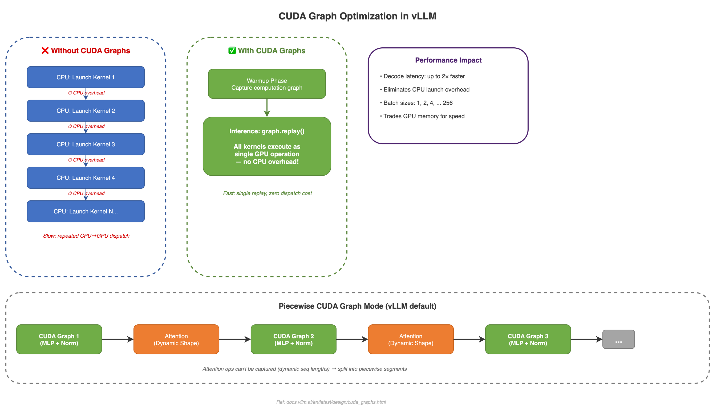
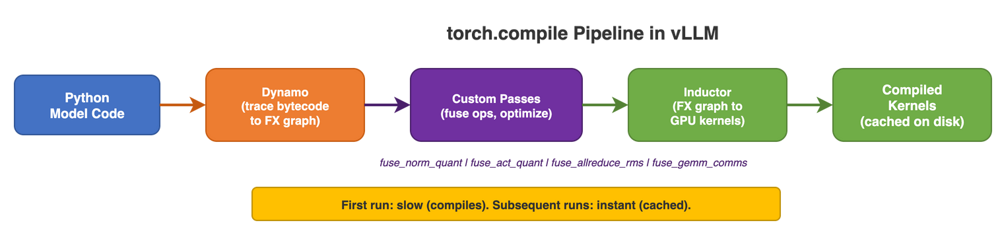

# 08 - Compilation & Performance

This page explains how vLLM uses compilation and CUDA graphs to squeeze maximum performance out of your GPU. These techniques can make inference significantly faster -- often 2-3x for the decode phase.



---

## Why Does This Matter?

Here's the problem: GPUs are incredibly fast at math, but there's overhead every time the CPU tells the GPU what to do. Each instruction from the CPU to the GPU is called a *kernel launch*, and a single model forward pass might involve **hundreds** of kernel launches.

Without optimization, the GPU spends a lot of time waiting for instructions instead of doing actual work. It's like a chef who can cook incredibly fast but has to wait for a new order slip after every single step -- "chop onions" ... wait ... "heat oil" ... wait ... "add onions" ... wait.

**Compilation and CUDA graphs remove this overhead** by letting the GPU work continuously with minimal interruptions.

---

## The Two Key Techniques

### 1. torch.compile -- Making Smarter Kernels



`torch.compile` takes your model's Python code and transforms it into optimized GPU kernels. Here's the full pipeline in detail:

**Stage 1: Dynamo (Python → Graph)**
Dynamo traces the Python bytecode of your model's `forward()` method. It doesn't run the code -- it *records* what operations the code would perform. The output is an FX graph (a directed acyclic graph of tensor operations). Dynamo works at the bytecode level (CPython opcodes), which means it can trace through most Python control flow, including loops and conditionals that are data-independent.

**Stage 2: Custom vLLM Passes (Graph → Optimized Graph)**
vLLM applies custom optimization passes that fuse multiple operations into single kernels. For example, `fuse_norm_quant` merges RMSNorm + Quantization into one kernel launch instead of two. There are 10 fusion passes in `vllm/compilation/passes/fusion/`:

```
act_quant_fusion.py        # SiLU + Mul + Quantize → 1 kernel
rms_quant_fusion.py        # RMSNorm + Quantize → 1 kernel
attn_quant_fusion.py       # Attention + Quantize → 1 kernel
allreduce_rms_fusion.py    # AllReduce + RMSNorm → 1 kernel (overlaps comms)
collective_fusion.py       # GEMM + TP communication → overlapped
qk_norm_rope_fusion.py     # QK norm + RoPE → 1 kernel
sequence_parallelism.py    # Sequence parallel optimizations
```

**Stage 3: Inductor (Optimized Graph → CUDA Kernels)**
PyTorch's Inductor backend takes the optimized FX graph and generates actual CUDA/Triton kernels. It handles memory planning, loop tiling, and register allocation. The generated kernels are compiled by `nvcc` or the Triton compiler.

**Stage 4: Caching (Kernels → Disk)**
Compiled kernels are cached to disk so subsequent runs skip compilation entirely.

**Key benefit: operation fusion.** Instead of running RMSNorm and then Quantization as two separate kernel launches, vLLM fuses them into a single kernel. Fewer launches = less overhead = faster inference.

### Under the Hood: What Dynamo Actually Does

Dynamo intercepts Python bytecode execution via `sys.settrace` or a bytecode hook. When your model's `forward()` method is called:

1. Dynamo pauses normal Python execution
2. It traces through the bytecode, recording every tensor operation
3. It builds an FX graph of these operations
4. It hands the graph to the backend (Inductor) for compilation
5. Future calls skip tracing and run the compiled code directly

vLLM's `TorchCompileWithNoGuardsWrapper` (in `wrapper.py`) takes this further by **dropping all Dynamo guards**. Normally, Dynamo adds "guards" -- runtime checks that verify assumptions still hold (e.g., tensor shapes haven't changed). If a guard fails, Dynamo recompiles. vLLM drops these guards because it controls the input shapes and guarantees they won't change unexpectedly:

```python
# From vllm/compilation/wrapper.py
# Drop all guards to avoid any recompilation
options["guard_filter_fn"] = lambda x: [False for _ in x]
```

This means vLLM compiles exactly once and never recompiles -- a significant startup time savings for long-running servers.

### 2. CUDA Graphs -- Recording and Replaying

CUDA Graphs take a completely different approach. Instead of optimizing individual kernels, they **record an entire sequence of GPU operations** and then replay the whole thing with a single command.

*Analogy*: Imagine recording a recipe on video. The first time, you do every step manually (measure, chop, stir). After that, you just press "play" -- all the steps happen automatically, without you reading each instruction. That's what CUDA graphs do for GPU operations.

**Without CUDA Graphs**: CPU launches kernel 1 ... CPU launches kernel 2 ... CPU launches kernel 3 ... (CPU overhead between each)

**With CUDA Graphs**: CPU says "replay graph" ... GPU executes kernels 1, 2, 3 all at once (near-zero CPU overhead)

---

## Optimization Levels

vLLM offers different compilation modes through `CompilationMode`. Think of these like quality settings in a video game -- higher levels give better performance but may have compatibility trade-offs.

```bash
vllm serve model --compilation-config '{"level": 3}'
```

| Level | Name | What It Does | When to Use |
|-------|------|-------------|-------------|
| 0 | `NONE` | No compilation, no CUDA graphs | Debugging or testing -- you want to see raw behavior |
| 1 | `STOCK_TORCH_COMPILE` | Standard `torch.compile` pipeline | Safe option if you hit issues with higher levels |
| 2 | `DYNAMO_TRACE_ONCE` | Single Dynamo trace, no recompilation | Good balance of safety and speed |
| 3 | `VLLM_COMPILE` | Custom vLLM Inductor backend with caching, fusion passes, piecewise compilation, shape specialization | **Default for V1** -- best performance for most models |

For most users, the default (level 3 / `VLLM_COMPILE`) is the right choice. You only need to change this if you're debugging or hitting compatibility issues.

---

## CUDA Graph Modes

CUDA graphs can be captured in different ways, depending on how much of the model you want to record:

| Mode | What Gets Recorded | Best For |
|------|-------------------|----------|
| `NONE` | Nothing | Debugging |
| `PIECEWISE` | Everything except attention operations | Safe default -- attention has dynamic shapes that can't be recorded |
| `FULL` | The entire model forward pass | Maximum decode performance |
| `FULL_DECODE_ONLY` | Full graph for decode only | Keeps prefill flexible while optimizing decode |
| `FULL_AND_PIECEWISE` | Both full and piecewise graphs (default) | Best overall -- uses full graphs when possible, piecewise as fallback |

---

## How CUDA Graphs Work Step by Step

### Warmup Phase (happens once at startup)

When vLLM starts up, it "rehearses" the model forward pass at various batch sizes:

1. For each batch size in [1, 2, 4, 8, ..., 512]:
   - Create a dummy input of that size
   - Run the model forward pass while CUDA records every GPU operation
   - Save the recording as a CUDA graph

This is why vLLM takes a bit longer to start up -- it's creating these recordings. But the payoff during inference is huge.

### Under the Hood: Memory Overhead of CUDA Graphs

Each CUDA graph captures not just the operations but also allocates **persistent memory buffers** for all intermediate tensors. This means:

- **Per-graph memory**: Each batch size captures its own graph with its own buffers. For a 7B model, each graph might use 50-200 MB depending on batch size.
- **Total overhead**: With default batch sizes [1, 2, 4, 8, 16, 32, 64, 128, 256, 512], that's 10 graphs × ~100 MB = ~1 GB of extra GPU memory.
- **Memory pool sharing**: vLLM uses a global CUDA graph memory pool (`current_platform.get_global_graph_pool()`) so graphs can reuse memory from each other, reducing the actual overhead.

This is why you might see less available KV cache memory when CUDA graphs are enabled. The trade-off is worth it: decode latency drops by 2-3x.

### Inference Phase (every step)

1. Pad the current batch to the nearest recorded size (e.g., 5 requests gets padded to 8)
2. Copy the actual inputs into the graph's pre-allocated input buffers
3. Call `graph.replay()` -- a single CUDA API call that runs the entire forward pass
4. Read the outputs

```python
# From vllm/compilation/cuda_graph.py (simplified)
# During capture:
cudagraph = torch.cuda.CUDAGraph()
with torch.cuda.graph(cudagraph, pool=self.graph_pool):
    output = self.runnable(*args, **kwargs)

# During replay (near-zero CPU overhead):
entry.cudagraph.replay()
return entry.output
```

---

## Graph Splitting (Piecewise Mode)

There's a catch: attention operations have *dynamic shapes* (the KV cache changes size as the conversation grows), so they can't be captured in a static CUDA graph.

vLLM's solution is to split the model at attention boundaries and capture everything else:

`[CUDA Graph 1: MLP+Norm]` --> `[Attention: runs dynamically]` --> `[CUDA Graph 2: MLP+Norm]` --> `[Attention: runs dynamically]` --> `[CUDA Graph 3: MLP+Norm]`

This way, the MLP and normalization layers (which are the majority of operations) still benefit from CUDA graphs, and attention runs with its required flexibility.

> See the "Piecewise CUDA Graph Mode" section in the diagram above for a visual breakdown.

---

## Custom Fusion Passes

vLLM includes custom optimization passes that fuse multiple operations into single kernels. Less kernel launches = less CPU overhead = faster inference.

| Pass | What It Fuses | Why It Helps |
|------|--------------|-------------|
| `fuse_norm_quant` | RMSNorm + Quantization | One kernel instead of two |
| `fuse_act_quant` | SiLU activation + Mul + Quantization | One kernel instead of three |
| `fuse_attn_quant` | Attention + Quantization | One kernel instead of two |
| `fuse_allreduce_rms` | AllReduce + RMSNorm | Overlaps multi-GPU communication with computation |
| `fuse_gemm_comms` | Matrix multiply + TP communication | Sends results to other GPUs while still computing |

---

## Compilation Cache

vLLM caches compiled kernels on disk so you don't have to wait for compilation every time you restart:

- **Location**: Stored per-model in a configurable directory
- **Cache key**: Based on model config + compilation config + quantization config
- **Benefit**: After the first run, subsequent startups skip compilation entirely -- saving minutes of startup time

### Startup Time: With vs Without Cache

| Phase | Cold Start (no cache) | Warm Start (cached) |
|-------|----------------------|---------------------|
| Model download | 30s-5min (depends on model size & network) | 0s (already downloaded) |
| torch.compile | 30-120s (Inductor generates & compiles kernels) | 2-5s (loads from disk) |
| CUDA graph warmup | 10-30s (captures graphs at each batch size) | 10-30s (always required) |
| **Total** | **1-7 minutes** | **15-40 seconds** |

The compilation cache is the biggest win here. On a cold start, Inductor generates Triton kernels, runs the Triton compiler, and may even invoke `nvcc` for CUDA code. On a warm start, it loads pre-compiled `.so` files from disk.

**Tip:** In production, warm the cache during deployment. Run the server once with a dummy request, then restart. All subsequent restarts will be fast.

---

## When to Disable Compilation

While compilation is almost always beneficial, there are cases where you should turn it off:

| Situation | Why Disable | What to Set |
|-----------|-------------|-------------|
| **Debugging model correctness** | Compilation can hide bugs by fusing operations | `--compilation-config '{"level": 0}'` |
| **Very short-lived processes** | Compilation overhead (30-120s) exceeds total inference time | `--compilation-config '{"level": 0}'` |
| **Custom model with unsupported ops** | Dynamo can't trace custom CUDA extensions | `--compilation-config '{"level": 1}'` for safe fallback |
| **Profiling individual kernels** | Fusion makes it hard to attribute time to specific operations | Disable specific fusion passes via `pass_config` |
| **Memory-constrained** | CUDA graphs use extra GPU memory (~1 GB) | Set `cudagraph_mode: NONE` but keep compilation |

```bash
# Disable everything (fully eager mode)
vllm serve model --compilation-config '{"level": 0}'

# Keep compilation but disable CUDA graphs (saves ~1 GB GPU memory)
vllm serve model --compilation-config '{"level": 3, "cudagraph_mode": "NONE"}'
```

---

## Gotchas and Tips

1. **"First request is slow"** -- This is expected. The first request triggers CUDA graph capture for that batch size. Subsequent requests at the same (or smaller) batch size reuse the graph.

2. **"Model uses more memory than expected"** -- CUDA graphs allocate persistent buffers. If you're memory-constrained, disable CUDA graphs but keep torch.compile for the fusion benefits.

3. **"Compilation failed with graph break"** -- vLLM requires `fullgraph=True` (no graph breaks). This means the entire forward pass must be traceable by Dynamo. If a model has data-dependent control flow (e.g., `if x.sum() > 0`), it will fail. Native vLLM models are designed to avoid this.

4. **"Recompilation detected"** -- vLLM sets `torch.compiler.set_stance("fail_on_recompile")` after the first compilation. If you see this error, something is changing between runs that shouldn't be (usually tensor shapes).

5. **Don't modify buffers in forward()** -- vLLM explicitly checks for this and raises an error: `"Assigning / modifying buffers of nn.Module during forward pass is not allowed when using cudagraph"`. This is because CUDA graphs replay the exact same memory operations, so any buffer modification would silently corrupt results.

---

## Key Files

| File | Purpose |
|------|---------|
| `vllm/compilation/wrapper.py` | torch.compile wrapper -- the entry point for compilation |
| `vllm/compilation/cuda_graph.py` | CUDA graph capture and replay logic |
| `vllm/compilation/passes/` | Custom fusion optimization passes (10 fusion files) |
| `vllm/compilation/passes/fusion/` | Individual fusion implementations |
| `vllm/compilation/monitor.py` | Compilation monitoring and logging |
| `vllm/config/compilation.py` | CompilationConfig -- all compilation settings |

---

## Related Concepts

- **[Architecture](ARCHITECTURE)** -- How the compilation system fits into vLLM's overall engine design
- **[Configuration](CONFIGURATION)** -- How to set compilation flags like `--compilation-config` and optimization levels
- **[Attention Backends](ATTENTION-BACKENDS)** -- Attention operations are the reason CUDA graphs need piecewise splitting
- **[Request Lifecycle](REQUEST-LIFECYCLE)** -- Compilation speeds up steps 7-9 (the GPU execution part) of every request
- **[Official Docs: Performance](https://docs.vllm.ai/en/latest/performance/optimization.html)** -- The official vLLM performance tuning guide
