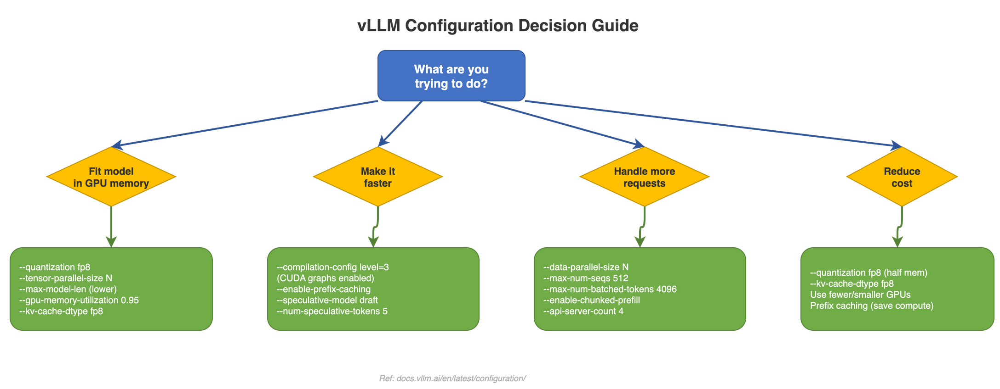

# 11 - Configuration Reference



This page covers the most important settings for running vLLM. Whether you're trying to fit a model in memory, speed up inference, or serve more users, this is your starting point.

---

## Quick Start: The 3 Most Important Flags

If you only remember three things, remember these:

```bash
vllm serve meta-llama/Llama-3.1-8B \
  --gpu-memory-utilization 0.9 \
  --max-model-len 4096 \
  --max-num-seqs 256
```

| Flag | What It Does | Why It Matters |
|------|-------------|----------------|
| `--gpu-memory-utilization` | How much GPU memory vLLM can use (0.0 to 1.0) | Higher = more room for KV cache = more concurrent requests. Default 0.9 (90%) is usually right. |
| `--max-model-len` | Maximum sequence length (prompt + response) | Lower = less memory per request = more concurrent requests. Set this to the longest conversation you expect. |
| `--max-num-seqs` | Maximum number of concurrent requests | Caps how many requests run at the same time. Higher = more throughput, but uses more memory. |

---

## VllmConfig: The Master Configuration

Under the hood, all settings are organized into a master config object:

```python
VllmConfig(
    model_config,       # Model architecture, tokenizer, data type
    cache_config,       # KV cache settings (memory, block size)
    parallel_config,    # Multi-GPU settings (TP/PP/DP/EP)
    scheduler_config,   # Request scheduling (batch size, concurrency)
    attention_config,   # Attention backend selection
    compilation_config, # torch.compile, CUDA graphs
    quant_config,       # Quantization settings
    lora_config,        # LoRA adapter settings
    speculative_config, # Speculative decoding
    load_config,        # Weight loading options
)
```

You don't need to understand all of these -- the sections below group them by what you're trying to accomplish.

---

## What Are You Trying to Do?

### "I need the model to fit in GPU memory"

| Flag | Default | What It Does | Tip |
|------|---------|-------------|-----|
| `--gpu-memory-utilization` | 0.9 | Fraction of GPU memory vLLM can use | Try 0.95 if you're tight on memory |
| `--max-model-len` | auto | Maximum sequence length | Lower this to free up memory for more requests |
| `--quantization` | auto | Compression method (fp8, gptq, awq, etc.) | Use `fp8` on Hopper GPUs for near-lossless compression |
| `--kv-cache-dtype` | auto | KV cache precision | Set to `fp8_e4m3` for 50% KV cache memory savings |
| `--dtype` | auto | Model weight precision | Usually auto-detected; `half` or `bfloat16` are common |
| `--tensor-parallel-size` | 1 | Split model across N GPUs | Use when the model is too large even after quantization |

**Example -- fitting a 70B model on 4 GPUs:**

```bash
vllm serve meta-llama/Llama-3.1-70B \
  --tensor-parallel-size 4 \
  --gpu-memory-utilization 0.9
```

**Example -- fitting a 70B model on 1 GPU with quantization:**

```bash
vllm serve meta-llama/Llama-3.1-70B \
  --quantization fp8 \
  --kv-cache-dtype fp8_e4m3
```

### "I want to speed up inference"

| Flag | Default | What It Does | Tip |
|------|---------|-------------|-----|
| `--compilation-config` | level 3 | Optimization level (0-3) | Default is already best; lower for debugging |
| `--enable-prefix-caching` | true | Reuse KV cache for shared prefixes | Huge speedup if users share system prompts |
| `--max-num-batched-tokens` | auto | Max tokens processed per step | Higher = better GPU utilization, but more memory |
| `--block-size` | 16 | KV cache block size | Usually leave at default |

**Example -- maximum performance tuning:**

```bash
vllm serve meta-llama/Llama-3.1-8B \
  --enable-prefix-caching \
  --gpu-memory-utilization 0.95 \
  --max-num-batched-tokens 8192
```

### "I want to serve more users (reduce cost per request)"

| Flag | Default | What It Does | Tip |
|------|---------|-------------|-----|
| `--max-num-seqs` | 256 | Max concurrent requests | Higher = more throughput |
| `--data-parallel-size` | 1 | Number of model replicas | Each replica handles different requests |
| `--kv-cache-dtype` | auto | KV cache precision | `fp8_e4m3` = 50% less cache memory = more concurrent requests |

**Example -- high-throughput serving:**

```bash
vllm serve meta-llama/Llama-3.1-8B \
  --max-num-seqs 512 \
  --kv-cache-dtype fp8_e4m3 \
  --gpu-memory-utilization 0.95
```

---

## All Settings at a Glance

### Memory & Performance

| Flag | Default | What It Does |
|------|---------|-------------|
| `--gpu-memory-utilization` | 0.9 | Fraction of GPU memory for KV cache |
| `--max-model-len` | auto | Max sequence length |
| `--max-num-seqs` | 256 | Max concurrent requests |
| `--max-num-batched-tokens` | auto | Max tokens per scheduler step |
| `--kv-cache-dtype` | auto | KV cache precision (auto/fp8) |
| `--block-size` | 16 | KV cache block size |
| `--enable-prefix-caching` | true | Reuse KV cache for shared prefixes |

### Parallelism

| Flag | Default | What It Does |
|------|---------|-------------|
| `--tensor-parallel-size` | 1 | Number of GPUs for tensor parallelism |
| `--pipeline-parallel-size` | 1 | Number of pipeline stages |
| `--data-parallel-size` | 1 | Number of model replicas |

### Quantization

| Flag | Default | What It Does |
|------|---------|-------------|
| `--quantization` | auto | Quantization method (fp8, gptq, awq, etc.) |
| `--kv-cache-dtype` | auto | KV cache quantization |

### Model

| Flag | Default | What It Does |
|------|---------|-------------|
| `--model` | required | HuggingFace model ID or local path |
| `--tokenizer` | same as model | Tokenizer to use (usually auto-detected) |
| `--dtype` | auto | Model weight precision |
| `--trust-remote-code` | false | Allow custom model code from HuggingFace |

---

## Key Environment Variables

| Variable | What It Does | Example |
|----------|-------------|---------|
| `CUDA_VISIBLE_DEVICES` | Select which GPUs to use | `CUDA_VISIBLE_DEVICES=0,1` |
| `VLLM_ATTENTION_BACKEND` | Override the attention backend | `FLASH_ATTN`, `FLASHINFER` |
| `VLLM_USE_V1` | Force V1 engine (default: enabled) | `VLLM_USE_V1=1` |
| `VLLM_LOGGING_LEVEL` | Set log verbosity | `DEBUG`, `INFO`, `WARNING` |
| `VLLM_CONFIGURE_LOGGING` | Enable/disable vLLM logging setup | `0` to disable |
| `VLLM_WORKER_MULTIPROC_METHOD` | How workers are spawned | `spawn` or `fork` |

---

## Common Mistakes

**1. Setting `--max-model-len` too high**
If you set this to 128K but your users only need 4K, you're reserving memory for sequences that will never be that long. This wastes KV cache space and reduces how many concurrent requests you can serve. Set it to the actual maximum you need.

**2. Forgetting `--tensor-parallel-size` for large models**
If you get an out-of-memory error on startup, the model doesn't fit on one GPU. Either add `--tensor-parallel-size N` (where N is the number of GPUs) or add `--quantization fp8`.

**3. Using `--gpu-memory-utilization 1.0`**
Don't use all 100% of GPU memory -- the operating system and CUDA runtime need some memory too. Stick with 0.9-0.95.

**4. Not using `--trust-remote-code` when needed**
Some models on HuggingFace include custom Python code. If vLLM fails with a "model not found" error for a model you know exists, try adding `--trust-remote-code`.

**5. Setting `--max-num-seqs` too high without enough memory**
More concurrent requests means more KV cache entries. If you set this very high but don't have enough GPU memory, requests will get preempted (paused and restarted), which hurts performance. Start with the default (256) and increase gradually.

---

## Practical Tuning Tips

1. **Start with defaults and adjust.** vLLM's defaults are well-tuned. Only change settings when you have a specific problem to solve.

2. **Monitor with `--logging-level INFO`.** This shows you how much KV cache memory is available and how many blocks are allocated -- very useful for tuning.

3. **Enable prefix caching for chatbots.** If many users share the same system prompt, `--enable-prefix-caching` avoids recomputing the same KV cache over and over.

4. **Reduce `--max-model-len` to fit more users.** If your use case never needs more than 4K tokens, setting `--max-model-len 4096` frees up memory for more concurrent requests.

5. **Use FP8 KV cache on Hopper GPUs.** Adding `--kv-cache-dtype fp8_e4m3` is a free 50% memory savings on the KV cache with minimal quality impact.

6. **Profile before optimizing.** Check if your bottleneck is memory (can't serve enough users), latency (responses are slow), or throughput (not enough requests per second). The fix is different for each.

---

## Key Files

| File | Purpose |
|------|---------|
| `vllm/config/vllm.py` | VllmConfig -- the master configuration object |
| `vllm/config/model.py` | ModelConfig -- model architecture and tokenizer settings |
| `vllm/config/cache.py` | CacheConfig -- KV cache memory and block settings |
| `vllm/config/compilation.py` | CompilationConfig -- torch.compile and CUDA graph settings |
| `vllm/envs.py` | All environment variables vLLM reads |

---

## Related Concepts

- **[Architecture](ARCHITECTURE)** -- Understand the components you're configuring (engine, scheduler, workers)
- **[Request Lifecycle](REQUEST-LIFECYCLE)** -- See how your settings affect each step of request processing
- **[Scheduling & KV Cache](SCHEDULING-KV-CACHE)** -- Deep dive into how `--max-num-seqs`, `--block-size`, and `--enable-prefix-caching` actually work
- **[Quantization](QUANTIZATION)** -- Details on all quantization methods available via `--quantization`
- **[Distributed Inference](DISTRIBUTED)** -- How to set up multi-GPU serving with `--tensor-parallel-size` and friends
- **[Compilation & Performance](COMPILATION)** -- What the `--compilation-config` flag controls under the hood
- **[Official Docs: Engine Arguments](https://docs.vllm.ai/en/latest/serving/engine_args.html)** -- The complete list of all CLI flags and their defaults
