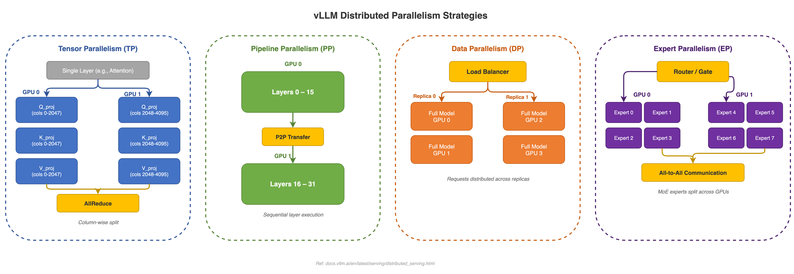
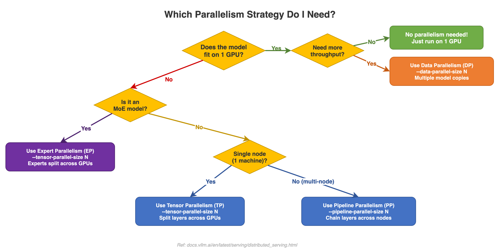

# 07 - Distributed Inference

This page explains how to run models across multiple GPUs. If your model is too large for a single GPU, or you need more throughput than one GPU can deliver, distributed inference is the answer.



---

## When Do You Need This?

**Scenario 1: The model doesn't fit on one GPU.**
A 70B parameter model in FP16 needs ~140 GB of memory. A single GPU (even an H100) has 80 GB. You need to split the model across multiple GPUs.

**Scenario 2: You need more throughput.**
One GPU can only serve so many requests per second. By running multiple copies of the model, you can handle more users simultaneously.

**Scenario 3: You need lower latency for long sequences.**
Very long prompts take a while to process. Splitting the work across GPUs can speed up individual requests.

> **Tip**: Before going distributed, consider [Quantization](QUANTIZATION) first. A 70B model in 4-bit only needs ~35 GB -- it might fit on a single GPU! Quantization is simpler to set up than distributed inference.

---

## Under the Hood: Why Tensor Parallelism is Needed (Memory Math)

Let's do the math for Llama-3.1-70B to understand why a single GPU is not enough:

**Model weight memory:**
- 70 billion parameters x 2 bytes (FP16) = **140 GB** just for weights
- An A100 has 80 GB, an H100 has 80 GB -- neither can hold the model alone

**With TP=4 (4 A100-80GB GPUs):**
- Each GPU holds 140 GB / 4 = **35 GB** of model weights
- Remaining per GPU: 80 - 35 = **45 GB** for KV cache, activations, and overhead
- This leaves plenty of room for serving hundreds of concurrent requests

**With TP=2 (2 A100-80GB GPUs):**
- Each GPU holds 140 GB / 2 = **70 GB** of model weights
- Remaining per GPU: 80 - 70 = **10 GB** for KV cache
- This is very tight -- you can serve maybe 5-10 concurrent requests at most

**Real-world rule of thumb:**
| Model | FP16 Memory | Min GPUs (A100-80GB) | Recommended |
|-------|-------------|---------------------|-------------|
| 7-8B | ~16 GB | 1 | 1 (plenty of room) |
| 13B | ~26 GB | 1 | 1 |
| 70B | ~140 GB | 2 (tight) | 4 (comfortable) |
| 405B | ~810 GB | 12 (tight) | 16 |

**Note**: KV cache memory grows with sequence length and concurrency. At 4K context with 100 concurrent requests on Llama-3.1-70B with TP=4, KV cache alone uses ~20 GB per GPU. That is why the "recommended" column has more GPUs than the minimum.

---

## The Four Types of Parallelism

### Tensor Parallelism (TP) -- Splitting a Task Among Workers

*Analogy*: Imagine you need to paint a large wall. Instead of one painter doing the whole thing, you split the wall into sections and four painters each paint their section at the same time. At the end, you have the complete painted wall.

**How it works**: Each layer of the model is split across GPUs. For example, a weight matrix of size `[4096 x 4096]` is split so GPU 0 handles columns 0-2047 and GPU 1 handles columns 2048-4095. After each layer, the GPUs share their results (via AllReduce) to stay in sync.

| Aspect | Detail |
|--------|--------|
| What gets split | Individual layer weights (QKV projections, output projections) |
| Communication | AllReduce after every layer via NCCL (fast GPU-to-GPU) |
| Constraint | Number of attention heads must be divisible by TP size |
| Best for | Single-node setups where you need low latency |

```bash
# Use 4 GPUs with tensor parallelism
vllm serve meta-llama/Llama-3.1-70B --tensor-parallel-size 4
```

### Pipeline Parallelism (PP) -- An Assembly Line

*Analogy*: Think of a car assembly line. Station 1 installs the engine, station 2 adds the body, station 3 paints it. Each station works on a different car at the same time. Cars flow through the pipeline one station at a time.

**How it works**: The model's layers are divided into sequential groups, and each group runs on a different GPU. For a 48-layer model with PP=3: GPU 0 runs layers 0-15, GPU 1 runs layers 16-31, GPU 2 runs layers 32-47. Data flows from one GPU to the next.

| Aspect | Detail |
|--------|--------|
| What gets split | Sequential groups of layers |
| Communication | Point-to-point send/receive between stages |
| Constraint | Number of layers must be divisible by PP size |
| Best for | Multi-node setups or very large models |

```bash
# Split across 2 pipeline stages
vllm serve meta-llama/Llama-3.1-405B --tensor-parallel-size 4 --pipeline-parallel-size 2
```

### Data Parallelism (DP) -- Multiple Identical Kitchens

*Analogy*: A restaurant chain opens multiple identical kitchens. Each kitchen has the same equipment and menu. When customers order, a host directs them to whichever kitchen has the shortest wait time.

**How it works**: The entire model is copied (replicated) across GPU groups. Each replica handles different requests independently. A load balancer distributes incoming requests across replicas.

For example, with DP=2 and TP=2: Replica 0 (GPU 0-1) handles requests 1, 3, 5... while Replica 1 (GPU 2-3) handles requests 2, 4, 6...

| Load Balancing Mode | How It Works |
|--------------------|-------------|
| Internal LB | vLLM automatically distributes requests across replicas |
| External LB | An external load balancer (like nginx) routes to separate API endpoints |
| Hybrid LB | Combination of both approaches |

```bash
# 2 data-parallel replicas, each using 4-GPU tensor parallelism (8 GPUs total)
vllm serve meta-llama/Llama-3.1-70B --tensor-parallel-size 4 --data-parallel-size 2
```

### Expert Parallelism (EP) -- Specialist Workers

*Analogy*: In a hospital, you don't have every doctor do everything. Instead, you have specialists: a cardiologist, a neurologist, an orthopedist. Patients get routed to the right specialist for their condition.

**How it works**: This is for Mixture of Experts (MoE) models like Mixtral or DeepSeek-V3, where each token is routed to a subset of "expert" sub-networks. EP distributes these experts across GPUs. For a model with 8 experts and EP=4: GPU 0 hosts experts 0-1, GPU 1 hosts experts 2-3, and so on.

| Feature | What It Does |
|---------|-------------|
| EPLB (Expert Parallel Load Balancing) | Redistributes popular ("hot") experts across GPUs to balance the workload |
| DeepEP | Optimized communication protocol for expert parallelism |
| Online Reconfiguration | Dynamically moves experts based on real-time traffic patterns |

---

## Context Parallelism: Splitting Long Sequences

For very long sequences (100K+ tokens), even a single prompt might benefit from being split across GPUs:

| Type | What It Does | When to Use |
|------|-------------|-------------|
| Prefill CP (PCP) | Splits a long prompt's prefill across GPUs | Extremely long input prompts |
| Decode CP (DCP) | Splits KV cache reads across GPUs | Very long conversations |

---

## AllReduce: The Communication Overhead

The main cost of tensor parallelism is **AllReduce** -- the operation where all GPUs exchange partial results and combine them. Understanding AllReduce overhead is critical for choosing the right parallelism strategy.

**What happens in AllReduce:**
1. Each GPU computes a partial result (e.g., partial attention output)
2. All GPUs send their partials to each other
3. Each GPU sums all the partials to get the full result

**How much overhead?** For Llama-3.1-70B with TP=4 on NVLink (900 GB/s bidirectional):
- Each AllReduce transfers a tensor of size `[batch_size, seq_len, hidden_dim]`
- Hidden dim = 8192 in FP16 = 16 KB per token
- For a batch of 256 tokens: 256 x 16 KB = 4 MB per AllReduce
- With NVLink at 900 GB/s, that is ~4.4 microseconds
- But there are 2 AllReduces per layer x 80 layers = 160 AllReduces per step
- Total: 160 x ~5 us = ~0.8 ms overhead per step

**When AllReduce becomes a bottleneck:**
- **Cross-node (InfiniBand/Ethernet)**: Bandwidth drops to 25-100 GB/s. The same AllReduce takes 40-160 us, and total overhead jumps to 6-25 ms -- a significant fraction of the decode step time.
- **Rule of thumb**: Use TP *within* a node (NVLink is fast), and PP *across* nodes (PP only needs point-to-point communication, not AllReduce).

---

## How NCCL Works (High Level)

All GPU-to-GPU communication in vLLM goes through **NCCL** (NVIDIA Collective Communications Library). Here is what you need to know:

1. **Process groups**: At startup, vLLM creates NCCL process groups for TP, PP, DP, and EP. Each group is a set of GPUs that need to communicate. This is managed by `parallel_state.py`:

```python
# From vllm/distributed/parallel_state.py
# The typical workflow:
# 1. init_distributed_environment()
# 2. initialize_model_parallel() -- creates TP, PP, DP groups
# 3. run inference using get_tp_group(), get_pp_group(), etc.
# 4. destroy_model_parallel()
```

2. **Transport layers**: NCCL automatically picks the fastest transport:
   - **NVLink**: 900 GB/s (within a node, best case)
   - **PCIe**: ~64 GB/s (within a node, slower)
   - **InfiniBand**: 25-100 GB/s (cross-node)
   - **Ethernet (RoCE)**: 10-25 GB/s (cross-node, slowest)

3. **Custom AllReduce**: For small tensors, vLLM implements a custom AllReduce that bypasses NCCL for lower latency (see `vllm/distributed/device_communicators/`).

---

## Executor: Ray vs Multiprocessing

vLLM supports two methods for spawning GPU workers:

### Multiprocessing Executor (Default)

The default executor (`vllm/v1/executor/multiproc_executor.py`) uses Python's `multiprocessing` to spawn one process per GPU on the same machine. Workers communicate via shared memory and pipes.

```python
# From vllm/v1/executor/multiproc_executor.py
# Uses Python multiprocessing + shared memory message queues
# Workers are spawned as child processes
# Communication via MessageQueue (shared memory broadcast)
```

**Advantages**: Low overhead, no external dependencies, fast startup.
**Limitations**: Single-node only.

### Ray Executor (Multi-node)

For multi-node setups, vLLM uses [Ray](https://docs.ray.io/) to manage workers across machines. Ray handles process placement, communication, and fault tolerance.

```bash
# Start Ray on the head node
ray start --head

# Start Ray on worker nodes
ray start --address=<head-ip>:6379

# Launch vLLM (Ray is detected automatically)
vllm serve meta-llama/Llama-3.1-405B \
  --tensor-parallel-size 8 \
  --pipeline-parallel-size 2
```

**Advantages**: Multi-node support, automatic resource management.
**Limitations**: Adds Ray dependency, slightly higher latency due to Ray overhead.

---

## Multi-Node Setup Steps

Here is a step-by-step guide for running vLLM across 2 machines with 8 GPUs each (16 GPUs total):

**1. Ensure network connectivity:**
- All nodes must be able to reach each other on the NCCL port (default: a random high port)
- For best performance, use InfiniBand or RoCE
- Set `NCCL_SOCKET_IFNAME` to the right network interface (e.g., `ib0` for InfiniBand)

**2. Install Ray on all nodes:**
```bash
pip install ray
```

**3. Start the Ray cluster:**
```bash
# On head node (machine 1):
ray start --head --port=6379

# On worker node (machine 2):
ray start --address=<head-ip>:6379
```

**4. Launch vLLM from the head node:**
```bash
vllm serve meta-llama/Llama-3.1-405B-FP8 \
  --tensor-parallel-size 8 \
  --pipeline-parallel-size 2 \
  --distributed-executor-backend ray
```

This creates 2 pipeline stages (one per node), each with 8-way tensor parallelism.

**5. Verify:**
```bash
# Check Ray cluster status
ray status

# Check vLLM logs for "Successfully initialized distributed environment"
```

---

## How to Choose: A Decision Guide



Here's a simple guide for picking the right strategy:

**Step 1: Does the model fit on one GPU?**
- Yes --> No parallelism needed. You're done!
- No --> Go to step 2.

**Step 2: Can quantization make it fit?**
- Yes --> Use [Quantization](QUANTIZATION) instead. Simpler to set up.
- No --> Go to step 3.

**Step 3: Is everything on a single machine?**
- Yes (2-8 GPUs) --> Use **Tensor Parallelism** (TP). Set `--tensor-parallel-size` to the number of GPUs.
- No (multiple machines) --> Use **TP within each machine + PP across machines**. For example, 2 machines with 8 GPUs each: `--tensor-parallel-size 8 --pipeline-parallel-size 2`.

**Step 4: Need more throughput?**
- Add **Data Parallelism** (DP) to run multiple replicas. Each replica uses TP (and optionally PP).

**Step 5: Running a MoE model?**
- Add **Expert Parallelism** (EP) to distribute experts efficiently.

---

## Typical Configurations

| Model Size | GPUs | Strategy | Example Command |
|-----------|------|----------|----------------|
| 7-13B | 1 | None | `vllm serve meta-llama/Llama-3.1-8B` |
| 70B | 4 | TP=4 | `vllm serve meta-llama/Llama-3.1-70B --tensor-parallel-size 4` |
| 70B | 8 | TP=8 or TP=4,PP=2 | `vllm serve meta-llama/Llama-3.1-70B --tensor-parallel-size 8` |
| 405B (FP8) | 8 | TP=8 | `vllm serve meta-llama/Llama-3.1-405B-FP8 --tensor-parallel-size 8` |
| 405B | 16 | TP=8,PP=2 | `--tensor-parallel-size 8 --pipeline-parallel-size 2` |
| DeepSeek-V3 | 8 | TP=8,EP=8 | MoE model with expert parallelism |

---

## Communication Infrastructure

All GPU-to-GPU communication is managed by `GroupCoordinator`:

| Group | What It Handles | Operations | Backend |
|-------|----------------|-----------|---------|
| TP Group | Communication within a tensor-parallel group | `all_reduce`, `all_gather` | NCCL |
| PP Group | Communication between pipeline stages | `send_tensor_dict`, `recv_tensor_dict` | NCCL P2P |
| DP Group | Communication across data-parallel replicas | `broadcast`, `gather` | NCCL |
| EP Group | Communication for expert routing | `all_to_all` | NCCL |

Device communicators: `CudaCommunicator` (NCCL for GPUs), `CpuCommunicator` (Gloo for CPUs), and custom all-reduce for small tensors.

---

## Debugging Distributed Issues

Distributed setups are harder to debug. Here are common problems and how to fix them:

### NCCL Timeout

**Symptom**: `RuntimeError: NCCL communicator was aborted` or processes hang.

**Common causes and fixes:**
- **Firewall blocking NCCL ports**: Open all ports between nodes, or set `NCCL_SOCKET_IFNAME` to the correct network interface
- **Mismatched NCCL versions**: All nodes must use the same NCCL version
- **Network partition**: Check that all nodes can ping each other

```bash
# Debug NCCL issues:
export NCCL_DEBUG=INFO
export NCCL_DEBUG_SUBSYS=ALL
```

### GPU Memory Imbalance

**Symptom**: One GPU runs out of memory while others have plenty.

**Common causes:**
- GPU 0 uses extra memory for the embedding layer and LM head (these are not always split evenly)
- Other processes (monitoring, display) using GPU 0 memory

**Fix**: Set `CUDA_VISIBLE_DEVICES` to exclude GPUs used by other processes, or use `--gpu-memory-utilization 0.85` to leave more headroom.

### Slowdown with Cross-Node TP

**Symptom**: Adding more GPUs across nodes makes things slower, not faster.

**Cause**: AllReduce over Ethernet/InfiniBand is 10-90x slower than NVLink. TP requires AllReduce after every layer.

**Fix**: Never use TP across nodes. Use TP within a node and PP across nodes:
```bash
# BAD: TP=16 across 2 nodes (16 AllReduces per layer over network)
# GOOD: TP=8 within each node, PP=2 across nodes (only P2P sends between nodes)
vllm serve model --tensor-parallel-size 8 --pipeline-parallel-size 2
```

### Verifying Distributed Setup

```bash
# Check that all GPUs are visible
nvidia-smi

# Check NCCL connectivity (run on each node)
python -c "import torch; torch.distributed.init_process_group('nccl'); print('OK')"

# Check NVLink topology
nvidia-smi topo -m
```

---

## Gotchas and Tips

- **TP must divide the head count**: Llama-3.1-70B has 64 attention heads, so TP can be 1, 2, 4, 8, 16, 32, or 64. You cannot use TP=3 or TP=5.
- **PP adds latency bubbles**: With PP=2, each decode step has one pipeline "bubble" where one GPU idles while the other computes. This increases latency per token. PP is best for throughput, not latency.
- **DP doubles memory usage**: Each replica loads a full copy of the model. DP=2 with TP=4 uses 8 GPUs total but serves 2x the throughput.
- **Start simple**: Begin with TP only. Add PP only if you run out of GPUs on one node. Add DP only when you need more throughput.

---

## Key Files

| File | Purpose |
|------|---------|
| `vllm/distributed/parallel_state.py` | Process groups and communication primitives |
| `vllm/v1/executor/multiproc_executor.py` | Multi-process executor for spawning GPU workers |
| `vllm/distributed/device_communicators/` | NCCL, Gloo, and custom communicators |
| `vllm/distributed/eplb/` | Expert parallel load balancing |
| `vllm/distributed/kv_transfer/` | Disaggregated prefill (advanced) |

---

## Related Concepts

- **[Configuration](CONFIGURATION)** -- How to set parallelism flags like `--tensor-parallel-size`, `--pipeline-parallel-size`, and `--data-parallel-size`
- **[Architecture](ARCHITECTURE)** -- How the executor and worker components coordinate across GPUs in the overall system
- **[Quantization](QUANTIZATION)** -- An alternative to distributed inference: make the model smaller instead of using more GPUs (or combine both!)
- **[Compilation & Performance](COMPILATION)** -- CUDA graphs and torch.compile work alongside distributed execution to maximize GPU utilization
- **[Official Docs: Distributed Serving](https://docs.vllm.ai/en/latest/serving/distributed_serving.html)** -- The official guide for multi-GPU and multi-node deployment
- **[Official Docs: Tensor Parallelism](https://docs.vllm.ai/en/latest/serving/distributed_serving.html#distributed-inference-and-serving)** -- Detailed setup instructions for tensor parallelism
