# vLLM Mind-Map

A deep structural map of [vLLM](https://github.com/vllm-project/vllm) internals for newcomers to build mental models fast.

**Live site**: [abhiongithub.github.io/vllm-mindmap](https://abhiongithub.github.io/vllm-mindmap/)

**Official vLLM docs**: [docs.vllm.ai](https://docs.vllm.ai/en/latest/)

---

## What Is This?

This is a visual knowledge base that breaks down the entire vLLM codebase into digestible topics. Each page covers one major subsystem with:

- Detailed explanations of how things work and why they were designed that way
- Draw.io diagrams (editable `.drawio` + exported `.png`)
- References to the official vLLM documentation
- Key source file locations

## Topics Covered

| Page | What You Will Learn |
|------|-------------------|
| [Architecture Overview](https://abhiongithub.github.io/vllm-mindmap/ARCHITECTURE) | V1 multi-process engine design, P0/P1 split, ZMQ communication |
| [Request Lifecycle](https://abhiongithub.github.io/vllm-mindmap/REQUEST-LIFECYCLE) | 12-step journey of an inference request from HTTP to response |
| [Scheduling & KV Cache](https://abhiongithub.github.io/vllm-mindmap/SCHEDULING-KV-CACHE) | Scheduler algorithm, PagedAttention, prefix caching, block management |
| [Model System](https://abhiongithub.github.io/vllm-mindmap/MODEL-SYSTEM) | Model registry, 200+ architectures, weight loading pipeline |
| [Attention Backends](https://abhiongithub.github.io/vllm-mindmap/ATTENTION-BACKENDS) | 20+ attention kernels, MLA, FlashAttention, FlashInfer, backend selection |
| [Quantization](https://abhiongithub.github.io/vllm-mindmap/QUANTIZATION) | FP8, GPTQ, AWQ, INT8, 15+ methods, KV cache quantization |
| [Distributed Inference](https://abhiongithub.github.io/vllm-mindmap/DISTRIBUTED) | Tensor, Pipeline, Data, and Expert Parallelism |
| [Compilation & Performance](https://abhiongithub.github.io/vllm-mindmap/COMPILATION) | torch.compile, CUDA graphs, optimization levels, fusion passes |
| [API & Serving](https://abhiongithub.github.io/vllm-mindmap/API-SERVING) | OpenAI-compatible server, CLI commands, streaming, Python API |
| [Advanced Features](https://abhiongithub.github.io/vllm-mindmap/ADVANCED-FEATURES) | LoRA, multimodal, speculative decoding, tool calling, reasoning |
| [Configuration Reference](https://abhiongithub.github.io/vllm-mindmap/CONFIGURATION) | All important flags, environment variables, tuning knobs |
| [Codebase Map](https://abhiongithub.github.io/vllm-mindmap/CODEBASE-MAP) | Directory-to-purpose reference, files to read first |

## Diagrams

All diagrams are in the [`diagrams/`](diagrams/) folder as both editable `.drawio` files and exported `.png` images. Open the `.drawio` files in [draw.io](https://app.diagrams.net/) to edit.

| Diagram | Preview |
|---------|---------|
| Architecture Overview | 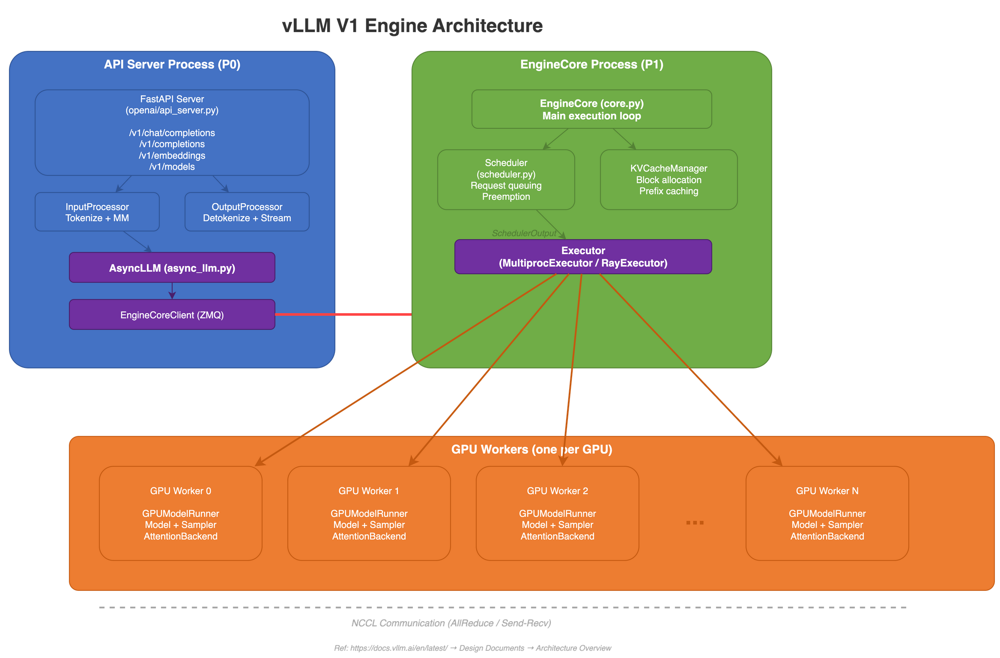 |
| Request Lifecycle |  |
| Scheduler Flow | 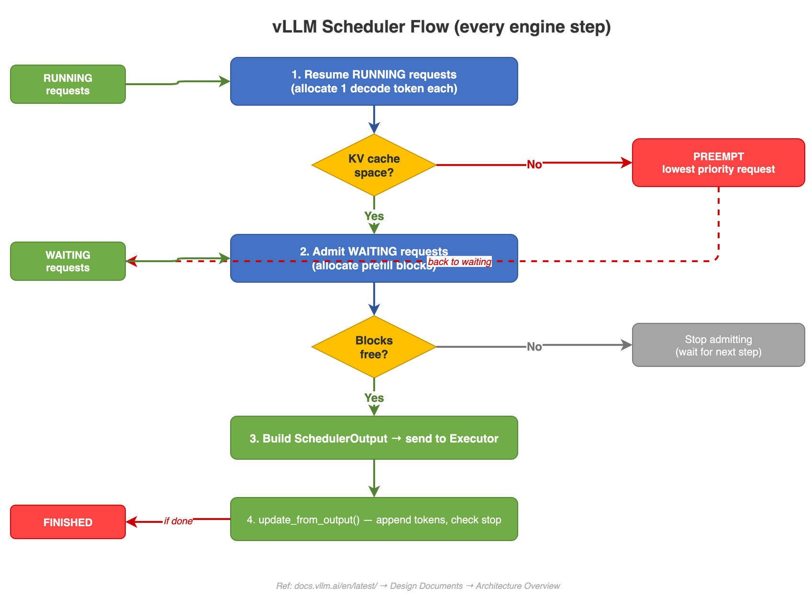 |
| PagedAttention | 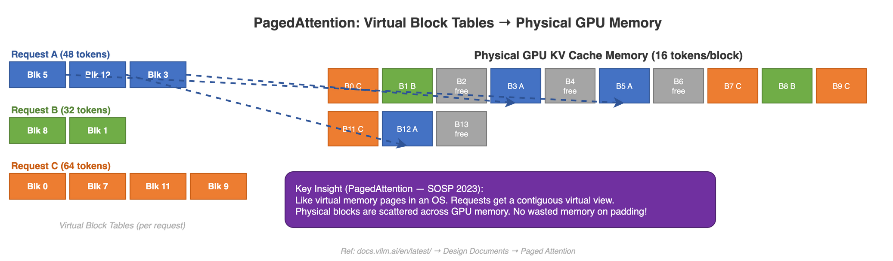 |
| Prefix Caching | 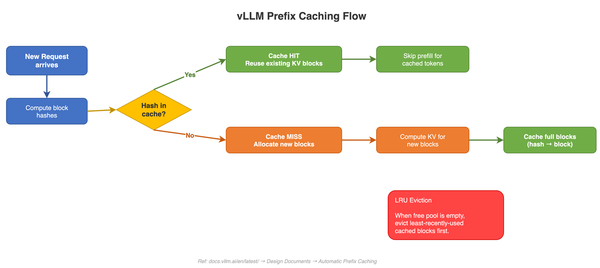 |
| Model Registry | 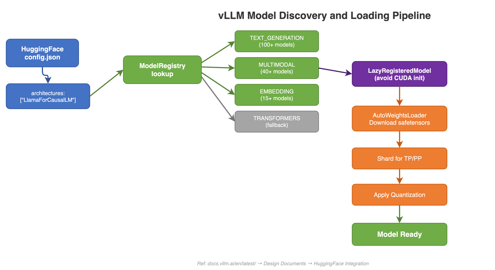 |
| Attention Backends | 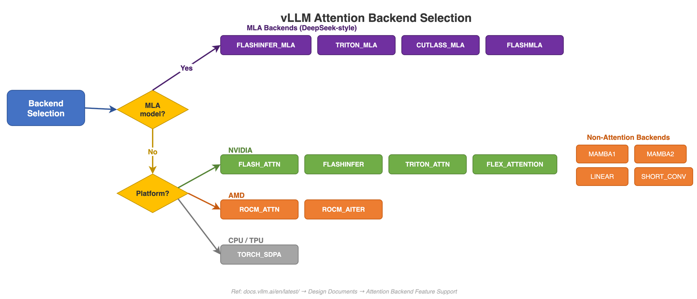 |
| Quantization Methods | 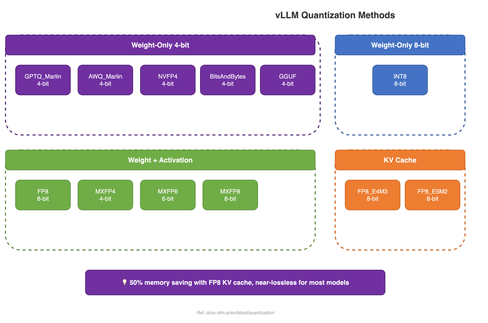 |
| Distributed Parallelism |  |
| CUDA Graphs |  |
| API Server | 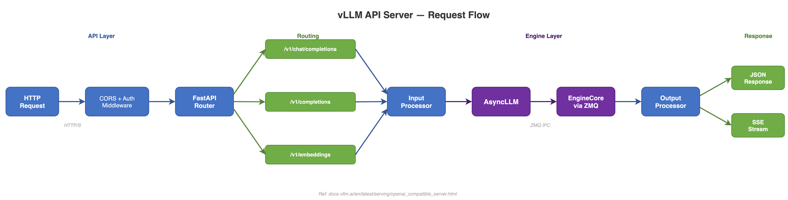 |
| Speculative Decoding | 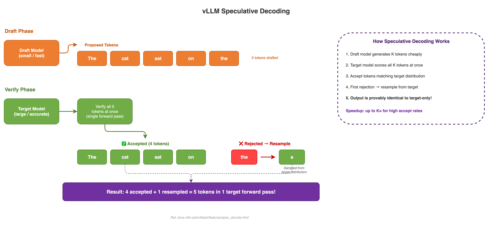 |
| KV Cache Hierarchy |  |
| Configuration Decision |  |
| Continuous Batching |  |
| LoRA Adapters | 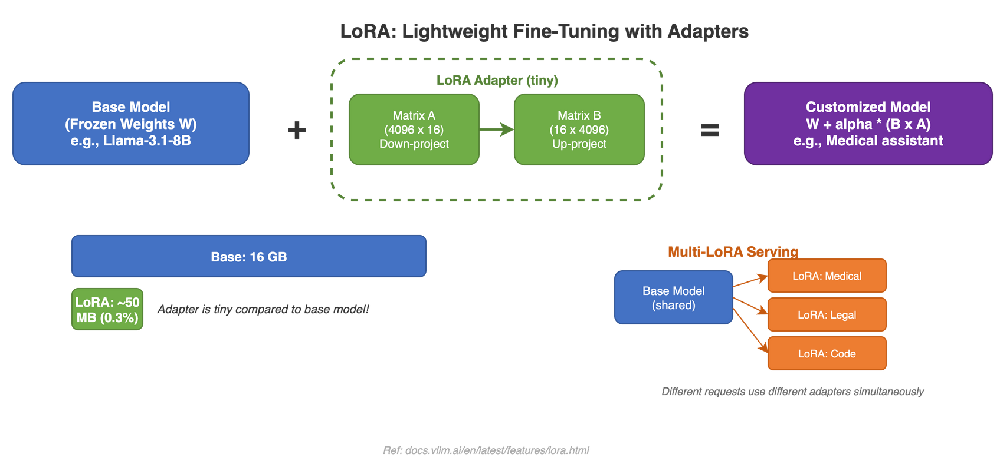 |
| Memory Savings | 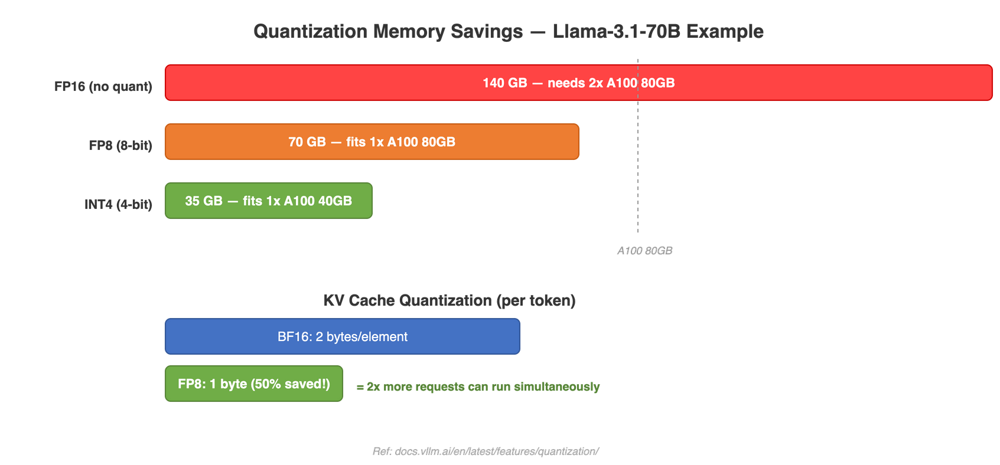 |
| Parallelism Decision |  |

## Features

- Dark/light theme toggle (persisted in localStorage)
- Sidebar navigation on every page
- Full-width responsive layout
- Mobile-friendly (sidebar collapses to top)
- Transparent PNG diagrams that work in both themes

## Built With

- [Jekyll](https://jekyllrb.com/) + [GitHub Pages](https://pages.github.com/)
- [Draw.io](https://app.diagrams.net/) for diagrams
- Custom HTML/CSS layout (no theme dependency)

## Contributing

Found an error or want to add detail? PRs welcome. Edit the `.md` files directly or modify the `.drawio` diagrams and re-export to PNG.

## License

This mind-map is based on the [vLLM](https://github.com/vllm-project/vllm) open-source project (Apache 2.0 License).
