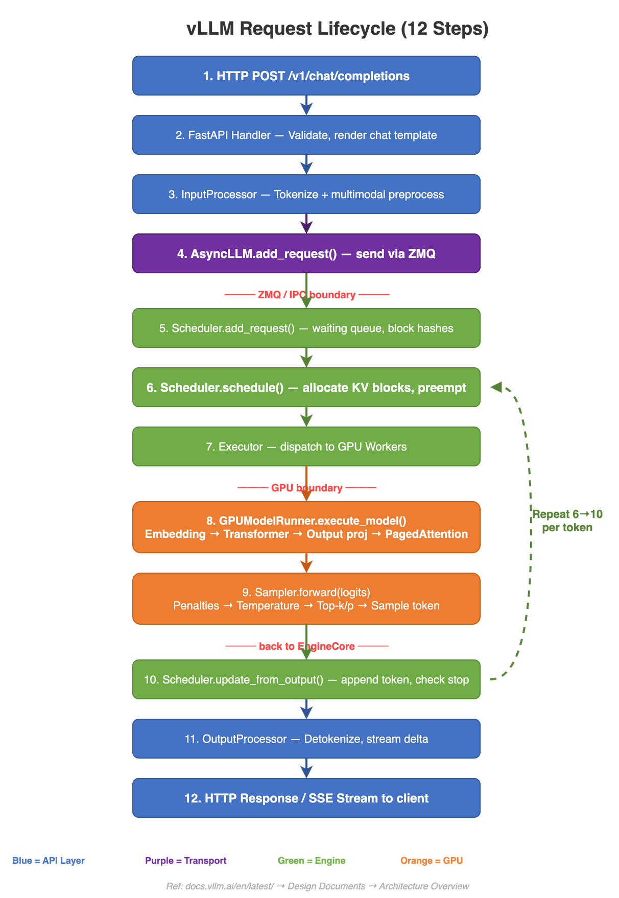
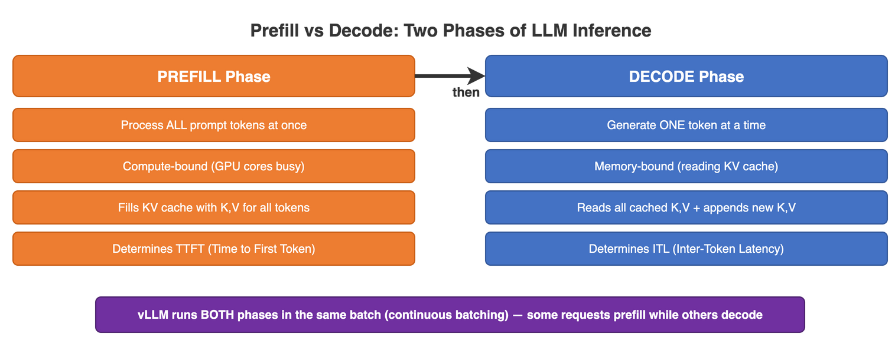
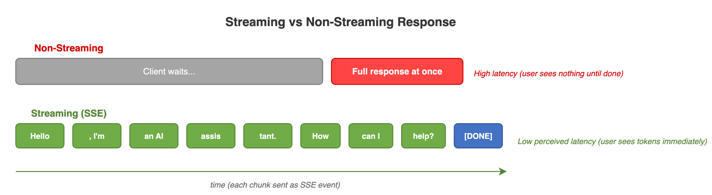
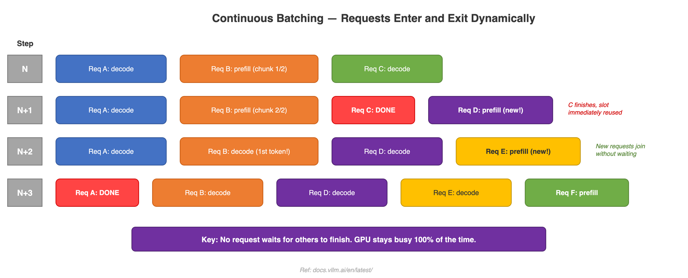

# 02 - Request Lifecycle

This page walks you through what happens inside vLLM from the moment you send a prompt to the moment you get a response back. Think of it like following a letter through the postal system -- each stop does one specific job before passing it along.

## End-to-End Flow



### The 12 Steps, Explained

Here is every step a request goes through, in plain English:

**1. HTTP POST -- You send your prompt**
Your application sends an HTTP request (usually to `/v1/chat/completions`). This is just like typing a question into a chat box and pressing "Send."

**2. FastAPI Handler -- The front door checks your request**
vLLM uses FastAPI as its web server. This step validates your parameters (are they the right type? are any missing?) and converts your chat messages into a single prompt string using a Jinja2 template. Think of it as a receptionist making sure your paperwork is in order.

**3. InputProcessor -- Turning words into numbers**
Computers don't understand words directly. The tokenizer breaks your prompt into *tokens* (small pieces of text, roughly one word or sub-word each) and converts them into numbers called `token_ids`. If your prompt includes images or audio, those get processed here too.

**4. AsyncLLM -- Handing off to the engine**
The request is packaged as an `EngineCoreRequest` and sent over a fast internal channel (ZMQ) to the EngineCore. This is the boundary between the "web server" part and the "AI engine" part of vLLM.

**5. Scheduler.add_request() -- Getting in line**
The scheduler creates an internal `Request` object, computes hash values for the prompt blocks (used for caching), and places the request in the *waiting queue*. Think of this like a restaurant host writing your name on the waitlist.

**6. Scheduler.schedule() -- Deciding who runs next**
Every *step* (one cycle of the engine), the scheduler looks at the waiting queue and the currently running requests. It decides:
- Which new requests can start (are there enough free memory blocks?)
- Which running requests should continue
- Whether any requests need to be paused (*preempted*) to make room for others

This is the "brain" of vLLM's efficiency. More details in [Scheduling & KV Cache](SCHEDULING-KV-CACHE).

**7. Executor -- Sending work to the GPU(s)**
The scheduler's decisions are packed into a `SchedulerOutput` and dispatched to the GPU workers. If you're running on multiple GPUs, the executor coordinates all of them.

**8. GPUModelRunner -- The actual AI computation**
This is where the magic happens. The model runner builds an `InputBatch` (all the tokens to process at once), runs the model's forward pass, and uses PagedAttention to efficiently read and write the KV cache. This step uses the GPU's massive parallel processing power.

**9. Sampler -- Picking the next token**
The model outputs a probability for every possible next token. The sampler applies your settings (temperature, top-k, top-p, repetition penalties) and then randomly picks one token based on those adjusted probabilities. Higher temperature = more creative; lower = more predictable.

**10. Scheduler.update_from_output() -- Recording what happened**
The newly generated token is appended to the request's output. The scheduler also checks: should we stop? Stopping happens when the model outputs a special end-of-sequence (EOS) token, or when `max_tokens` is reached, or when a stop string is found.

**11. OutputProcessor -- Turning numbers back into words**
The token ID is converted back into readable text (*detokenized*). If you asked for logprobs (probability information), those are formatted here too. The result is packaged as a `RequestOutput` delta (just the new piece).

**12. HTTP Response / SSE Stream -- You get your answer**
The result is sent back to your application. If you're using streaming, each new token is sent as a Server-Sent Event (SSE) so you see the response appear word by word, just like ChatGPT.

---

## Prefill vs. Decode: The Two Phases of Generation



Every request goes through two distinct phases. Understanding them is key to understanding how vLLM works:

### Prefill Phase -- "Reading the Question"

When your prompt arrives, the model needs to process all your input tokens before it can start generating a response. This is the **prefill** phase.

- All input tokens are processed **in parallel** (at the same time)
- The model builds a "memory" of your prompt called the **KV cache** (Key-Value cache)
- This phase is **compute-heavy** -- the GPU is doing a lot of math
- *Analogy*: Like reading an entire letter before writing a reply

### Decode Phase -- "Writing the Answer"

Once prefill is done, the model generates the response **one token at a time**. Each new token depends on all the tokens before it (both your prompt and the tokens generated so far).

- Only **one new token** is produced per step
- The model reads from the KV cache to "remember" earlier context
- This phase is **memory-heavy** -- the bottleneck is reading from the KV cache, not math
- *Analogy*: Writing a reply one word at a time, re-reading what you've written so far before choosing the next word

### Why the Distinction Matters

| Phase | What Happens | Bottleneck | Speed |
|-------|-------------|-----------|-------|
| **Prefill** | Process all prompt tokens in parallel | GPU compute (math) | Fast (many tokens at once) |
| **Decode** | Generate one token per step | GPU memory bandwidth (reading KV cache) | Slower (one token per step) |

Because prefill and decode have different resource needs, vLLM's scheduler can mix them in the same batch efficiently. A decode request (which is memory-bound) doesn't compete much with a prefill request (which is compute-bound) -- they use different parts of the GPU.

### Under the Hood: Compute-Bound vs Memory-Bound

**Prefill is compute-bound** because the GPU performs matrix multiplications across all prompt tokens at once. For a 1024-token prompt on Llama-3.1-8B, the GPU runs attention over all 1024 positions simultaneously -- this is a huge GEMM (General Matrix Multiply) operation that saturates the GPU's tensor cores.

**Decode is memory-bound** because each step generates only 1 token, but the GPU must read the entire KV cache from memory to compute attention. On an A100 (2 TB/s memory bandwidth, 312 TFLOPS), the arithmetic intensity during decode is so low that the GPU spends most of its time waiting for memory reads, not computing. This is why batching many decode requests together helps -- you amortize the memory read cost across multiple requests.

**Concrete numbers for Llama-3.1-8B on a single A100-80GB:**
- Prefill of 1024 tokens: ~15 ms (processes all tokens in parallel)
- Single decode step: ~10 ms (generates 1 token)
- So generating 256 output tokens takes: 15 ms (prefill) + 256 x 10 ms (decode) = ~2.6 seconds
- With batching 32 requests: decode step time barely increases (~12 ms for 32 requests), so throughput goes up ~30x

---

## Key Performance Metrics: TTFT and ITL

Two metrics define the user experience:

**TTFT (Time to First Token)** -- How long the user waits before seeing the first word of the response. This is dominated by the prefill phase. If your prompt is 2000 tokens long, prefill takes longer, and TTFT goes up. This is the metric users "feel" most -- a long TTFT makes the system feel sluggish.

**ITL (Inter-Token Latency)** -- The time between consecutive output tokens during the decode phase. This controls how fast the text streams in. For a smooth chat experience, you want ITL under ~50 ms (20 tokens/second). Humans read at about 4-5 words per second, so anything under 100 ms ITL feels "instant."

| Metric | What It Measures | Dominated By | Typical Range (8B model, A100) |
|--------|-----------------|-------------|-------------------------------|
| TTFT | Time until first token appears | Prefill duration | 10-200 ms (varies with prompt length) |
| ITL | Time between output tokens | Decode step time | 10-50 ms per token |
| Throughput | Total tokens/second across all requests | Batch size, GPU utilization | 1000-5000+ tok/s |

**Tip**: If TTFT is too high, check your prompt length and whether chunked prefill is enabled. If ITL is too high, you're likely memory-bandwidth bound -- consider a larger batch size or tensor parallelism.

---

## What SchedulerOutput Contains

When the scheduler makes its decisions, it packs everything into a `SchedulerOutput` dataclass (defined in `vllm/v1/core/sched/output.py`) and sends it to the GPU workers. Here is what it contains:

```python
# From vllm/v1/core/sched/output.py
@dataclass
class SchedulerOutput:
    scheduled_new_reqs: list[NewRequestData]       # First-time requests (full data)
    scheduled_cached_reqs: CachedRequestData       # Returning requests (only diffs)
    num_scheduled_tokens: dict[str, int]            # req_id -> tokens this step
    total_num_scheduled_tokens: int                 # Sum of all tokens this step
    scheduled_spec_decode_tokens: dict[str, list[int]]  # Speculative tokens
    scheduled_encoder_inputs: dict[str, list[int]]  # Multimodal encoder inputs
    num_common_prefix_blocks: list[int]             # For cascade attention
    finished_req_ids: set[str]                      # Requests done since last step
    free_encoder_mm_hashes: list[str]               # Encoder cache entries to free
```

The key optimization: for requests already running, vLLM only sends the *diff* (new blocks, new tokens) rather than the full request data. This is the `CachedRequestData` -- it contains only `new_block_ids` and `new_token_ids`, minimizing communication between the scheduler and GPU workers.

---

## How Streaming Works Internally



When you set `stream=True`, vLLM uses `IncrementalDetokenizer` (in `vllm/v1/engine/detokenizer.py`) to convert tokens to text one at a time:

```python
# From vllm/v1/engine/detokenizer.py
class IncrementalDetokenizer:
    def update(self, new_token_ids: list[int], stop_terminated: bool) -> str | None:
        self.token_ids.extend(new_token_ids)
        return None  # stop string match check

    def get_next_output_text(self, finished: bool, delta: bool) -> str:
        ...  # Returns only the NEW text since last call
```

There are two implementations:
- **FastIncrementalDetokenizer**: Uses the `tokenizers` library's native `DecodeStream` (requires tokenizers >= 0.22.0). This is a Rust-based streaming decoder.
- **SlowIncrementalDetokenizer**: Falls back to Python-based incremental detokenization for older tokenizer versions.

Each token is detokenized and sent back through a `RequestOutputCollector`, which merges deltas if the producer (engine) gets ahead of the consumer (HTTP response). The result is streamed as Server-Sent Events (SSE) to the client.

---

## Concrete Example: "Tell me a joke" on Llama-3.1-8B

Let's trace what happens end-to-end when you send this request:

```bash
curl http://localhost:8000/v1/chat/completions \
  -d '{"model": "meta-llama/Llama-3.1-8B-Instruct", "messages": [{"role": "user", "content": "Tell me a joke"}], "max_tokens": 100, "stream": true}'
```

**Step 1-2**: FastAPI receives the POST. The chat template converts the messages into: `<|begin_of_text|><|start_header_id|>user<|end_header_id|>\n\nTell me a joke<|eot_id|><|start_header_id|>assistant<|end_header_id|>\n\n`

**Step 3**: The tokenizer produces ~25 token IDs (the template adds special tokens).

**Step 4**: The `EngineCoreRequest` is sent to EngineCore via ZMQ.

**Step 5**: The scheduler hashes the prompt blocks, checks if any match the prefix cache (the system prompt portion might already be cached from a previous request), and adds the request to the waiting queue.

**Step 6**: On the next schedule() call, the scheduler admits the request. It needs ~2 KV cache blocks (25 tokens / 16 tokens per block = 2 blocks). These are allocated from the free pool.

**Step 7-8**: The GPU processes all 25 prompt tokens in one prefill pass (~5 ms). The KV cache is populated.

**Step 9**: The sampler picks the first output token (maybe "Why"). TTFT: ~20 ms total.

**Steps 8-12 repeat**: Each decode step generates one more token ("did", "the", "chicken", ...) at ~10 ms ITL. Each token is immediately detokenized and streamed back as an SSE event.

**Final**: After ~50-80 tokens, the model outputs `<|eot_id|>` (end of turn). The scheduler marks the request as finished. Its KV cache blocks are freed (or kept in the prefix cache for reuse).

---

## Continuous Batching

: The Restaurant Analogy

### The Problem with Traditional Batching

Traditional (static) batching is like a restaurant that seats 4 guests at a table and refuses to seat anyone new until all 4 have finished eating. If guest 1 finishes in 5 minutes but guest 4 takes 30 minutes, guest 1's chair sits empty for 25 minutes while new customers wait at the door.

In LLM inference, "finishing" means the model has generated all the tokens for a request. Some requests are short (a few tokens) and some are long (hundreds of tokens). With static batching, the GPU wastes time on padding while short requests wait for long ones.

### How vLLM's Continuous Batching Works

vLLM works like a restaurant that seats new guests **the moment a chair opens up**. It doesn't wait for the whole table to clear:

- New requests can join the running batch at **any** step
- Finished requests leave **immediately** (no waiting for others to finish)
- Prefill and decode requests share the same batch
- The GPU stays busy almost all the time, dramatically improving throughput

| Step | Slot 1 | Slot 2 | Slot 3 | Slot 4 |
|------|--------|--------|--------|--------|
| N | Req1:decode | Req2:prefill_chunk | Req3:decode | - |
| N+1 | Req1:decode | Req2:decode | **Req3:DONE** | Req4:prefill |
| N+2 | Req1:decode | Req2:decode | Req4:decode | Req5:prefill |

Notice how Req3 finishes at step N+1 and Req4 immediately takes its place -- no wasted GPU cycles.

---

## Chunked Prefill: Don't Let Long Prompts Block Everyone

Imagine you paste a 4,000-token document and ask for a summary. Without chunked prefill, the GPU would spend all its time processing your long prompt, and every other request in the system would stall.

**Chunked prefill** solves this by splitting long prompts into smaller pieces (chunks). Each chunk is processed in one step, and decode requests continue running alongside:

| Step | Tokens Processed | Other Requests |
|------|-----------------|----------------|
| 1 | 0-511 | Decodes continue |
| 2 | 512-1023 | Decodes continue |
| ... | ... | ... |
| 8 | 3584-4095 (prefill complete) | Decodes continue |
| 9 | First decode token generated | Decodes continue |

This way, existing users keep getting tokens while the new long prompt is being digested. Nobody gets starved.

---

## Performance Characteristics

| Workload | TTFT | ITL | Throughput | Key Bottleneck |
|----------|------|-----|-----------|----------------|
| Short prompts (<100 tokens) | 5-15 ms | 8-15 ms | High | Decode memory BW |
| Long prompts (4K+ tokens) | 50-200 ms | 8-15 ms | Medium | Prefill compute |
| High concurrency (100+ reqs) | 100-500 ms | 20-50 ms | Very high | KV cache memory |
| Long outputs (1K+ tokens) | Normal | 8-15 ms | Medium | Decode memory BW |

**What dominates total latency?** For short interactions (chat), decode dominates. For long-context tasks (summarization, RAG), prefill dominates. The scheduler's main job is to balance these two workloads.

---

## What Happens When Things Go Wrong

### Preemption (Memory Pressure)

When the KV cache is full and a new high-priority request arrives, the scheduler must **preempt** a running request. In vLLM V1, preemption means the request's KV cache blocks are freed and the request goes back to the waiting queue. When it is rescheduled, it must redo its entire prefill from scratch (recompute). This is expensive but keeps the system simple.

You will see log messages like: `WARNING: Request <id> preempted. KV blocks freed.`

### Out of Memory (OOM)

If `gpu_memory_utilization` is set too high (e.g., 0.98) and a large request arrives, the system may run out of KV cache blocks. The scheduler handles this gracefully: it simply stops admitting new requests until blocks are freed. However, if peak activation memory during prefill exceeds the budget, you can get a CUDA OOM crash. To prevent this:

- Lower `gpu_memory_utilization` (default 0.9 is safe for most cases)
- Reduce `max_num_batched_tokens` to limit peak activation memory
- Use `--max-model-len` to cap the maximum sequence length

### Request Timeouts

If a request takes too long (e.g., stuck in the queue during heavy load), the HTTP layer will time out. vLLM's `EngineCore` will abort the request and free its resources. Check `timeout` settings in your HTTP client.

---

## Gotchas and Tips

- **Prefix caching can slash TTFT**: If many requests share the same system prompt, the first request pays the full prefill cost, but subsequent requests skip the cached portion. For a 500-token system prompt, this saves ~10-20 ms per request.
- **Streaming doesn't speed up total generation**: It only changes *when* you see tokens. Total time is the same whether you stream or not.
- **Token counts are not word counts**: A prompt of "Tell me a joke" is ~5 tokens, but the chat template wraps it with special tokens, making it ~25 tokens. Always check `usage.prompt_tokens` in the response.
- **The first request is always slowest**: vLLM compiles CUDA graphs on first use. Subsequent requests benefit from the cached compilation.

---

## Common Mistakes

1. **Setting `max_tokens` too high**: If you set `max_tokens=4096` but only need 100 tokens, the scheduler still reserves memory for the worst case. Use realistic values.
2. **Ignoring `gpu_memory_utilization`**: The default of 0.9 reserves 90% of GPU memory. On shared GPUs, lower this to 0.7-0.8 to leave room for other processes.
3. **Not enabling streaming for chat**: Without streaming, the user waits for the entire response. With streaming, they see tokens immediately -- much better UX.
4. **Sending very long prompts without chunked prefill**: This blocks all other requests. Chunked prefill is enabled by default in V1, but check your config.

---

## Related Concepts

- **[Architecture](ARCHITECTURE)** -- See how the engine, scheduler, and workers are connected in the overall system design
- **[Scheduling & KV Cache](SCHEDULING-KV-CACHE)** -- Deep dive into how the scheduler decides what to run and how memory is managed with paged blocks
- **[API & Serving](API-SERVING)** -- How the HTTP server and OpenAI-compatible API endpoints work (steps 1, 2, and 12)
- **[Compilation & Performance](COMPILATION)** -- How CUDA graphs and torch.compile speed up steps 7-9 (the GPU computation)
- **[Attention Backends](ATTENTION-BACKENDS)** -- The different PagedAttention implementations used in step 8
- **[Official Docs: Serving](https://docs.vllm.ai/en/latest/serving/openai_compatible_server.html)** -- The official vLLM guide for setting up the API server
- **[Official Docs: Performance Tips](https://docs.vllm.ai/en/latest/performance/optimization.html)** -- Tuning TTFT, ITL, and throughput
