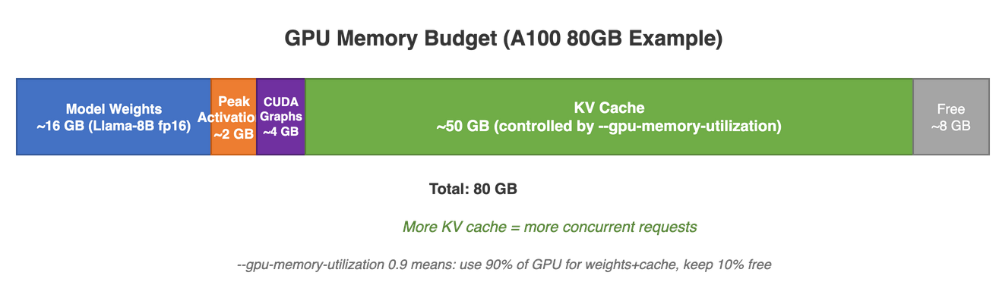

# 03 - Scheduling & KV Cache

## What Problem Does the Scheduler Solve?

Think of a busy restaurant. Guests (requests) arrive constantly, each needing a table (GPU memory) for their meal (generating tokens). Someone has to decide:

- **Who gets seated next?** (which request starts processing)
- **How many tables are free?** (how much GPU memory is available)
- **What if every table is full?** (what happens when memory runs out)

The **scheduler** is that restaurant host. Every "step" (a single round of processing), it looks at the current situation and makes these decisions. Without a smart scheduler, either the restaurant sits half-empty (wasting GPU capacity) or too many guests crowd in and things grind to a halt.

In vLLM, the scheduler's core job is to **maximize GPU utilization** — keep as many requests processing at once as possible — while making sure no single request hogs all the memory.

---

## Scheduler

### Scheduler Flow


Every time vLLM processes a batch (called a "step"), the scheduler runs a loop with two main phases:

1. **Take care of requests already being served** — These are the guests already eating. The scheduler checks if it can keep generating more tokens for them. If memory is too tight, some may need to be paused.
2. **Seat new guests** — Requests that are waiting in line get admitted if there's room.

This happens many times per second. The goal is to fill the GPU with as much useful work as possible in every step.

### How the Scheduling Algorithm Works (Every Step)

Here's what the scheduler does each step, in plain English:

1. **Go through all running requests.** For each one, check: "Can I allocate memory for the next token?" If yes, keep it going. If not, pause (preempt) it and put it back in the waiting line.
2. **Go through all waiting requests.** For each one, check: "Is there enough memory to start processing this?" If yes, admit it. If not, stop — no more room.
3. **Return the schedule** — a list of which requests to process this step and how many tokens each one needs.

Here is the pseudocode that captures this logic:

```python
def schedule():
    # 1. Resume running requests (allocate new decode tokens)
    for req in running:
        if can_allocate_slot(req):
            schedule_req(req)
        else:
            preempt(req)  # evict to waiting

    # 2. Admit new/waiting requests
    for req in waiting:
        if can_allocate_prefill(req):
            schedule_req(req)
        else:
            break  # no more capacity

    return SchedulerOutput(new_reqs, cached_reqs, token_counts)
```

### Under the Hood: The Real Schedule Loop

The actual implementation in `vllm/v1/core/sched/scheduler.py` is more nuanced. A key insight from the source code comment:

```python
# From vllm/v1/core/sched/scheduler.py, line 326
# NOTE(woosuk) on the scheduling algorithm:
# There's no "decoding phase" nor "prefill phase" in the scheduler.
# Each request just has num_computed_tokens and num_tokens_with_spec.
# At each step, the scheduler tries to assign tokens so that each
# request's num_computed_tokens can catch up its num_tokens_with_spec.
# This is general enough to cover chunked prefills, prefix caching,
# speculative decoding, and "jump decoding" in the future.
```

The scheduler tracks a `token_budget` (set by `max_num_batched_tokens`) and fills it greedily:

```python
# Simplified from the actual schedule() method
token_budget = self.max_num_scheduled_tokens  # e.g., 2048

# Phase 1: Running requests
for request in self.running:
    num_new_tokens = request.num_tokens_with_spec - request.num_computed_tokens
    # Apply chunked prefill limit
    if num_new_tokens > long_prefill_token_threshold:
        num_new_tokens = long_prefill_token_threshold
    num_new_tokens = min(num_new_tokens, token_budget)

    new_blocks = self.kv_cache_manager.allocate_slots(request, num_new_tokens)
    if new_blocks is not None:
        token_budget -= num_new_tokens
    else:
        preempt(request)  # No memory -- evict to waiting

# Phase 2: Waiting requests (similar logic, with prefix cache checks)
```

### Async Scheduling: Overlapping Compute and Scheduling

By default, the scheduler runs between GPU steps -- the GPU idles while the scheduler makes its decisions. **Async scheduling** overlaps the two: while the GPU is running step N, the scheduler is already planning step N+1.

This works because the scheduler's decisions for step N+1 only need the *expected* state after step N (not the actual output). The main benefit is reduced step latency, especially when the scheduler has complex decisions to make (many requests, prefix cache lookups, etc.).

The trade-off: async scheduling may occasionally over-schedule (allocating blocks for a request that turns out to finish in step N), but vLLM handles this gracefully.

### Preemption — "Sorry, We Need Your Table"

Imagine the restaurant is completely full, and a VIP guest (or just a long queue) needs a table. The host politely asks a guest who just sat down to wait in the lobby for a bit. That's **preemption**.

When the KV cache (GPU memory used to store intermediate results) is full, the scheduler must temporarily kick out some requests to make room for others.

| Policy | Evicts | Behavior |
|--------|--------|----------|
| FCFS | Last-arrived running request | Fair, predictable |
| Priority | Lowest-priority running request | Priority-aware |

Evicted requests go back to `waiting`. In V1, preemption means **recompute** — the KV blocks for that request are freed, and when the request gets rescheduled later, it has to redo its initial computation (prefill) from scratch. This is a trade-off: it keeps things simple and avoids the complexity of saving/restoring partial state.

### Chunked Prefill — Processing Long Prompts in Pieces

Some prompts are very long (thousands of tokens). If the scheduler tried to process an entire long prompt in one step, it would hog the GPU and block other requests from making progress.

**Chunked prefill** solves this by breaking a long prompt into smaller pieces (chunks) and processing one chunk per step. This way, short requests can make progress between chunks of a long request — like a restaurant that doesn't let one party of 50 lock out all other guests.

```
long_prefill_token_threshold = 512   # chunk size
max_num_batched_tokens = 2048        # total tokens per step
```

- `long_prefill_token_threshold`: If a prompt is longer than this, it gets chunked. Think of it as "if your party is bigger than 8, we'll seat you in groups."
- `max_num_batched_tokens`: The total number of tokens the GPU can handle in a single step. This is the "total restaurant capacity."

---

## KV Cache Management (PagedAttention)

### What is the KV Cache?

When a language model generates text, it needs to remember what it has already seen. For each token in the conversation, the model stores two vectors: a **Key** (K) and a **Value** (V). Together, these form the **KV cache** — essentially the model's short-term memory for a conversation.

The problem: this memory can be huge. A single request with thousands of tokens can use gigabytes of GPU memory. And if you're serving hundreds of users at once, you need a smart way to manage all that memory.

### The Core Idea — Virtual Memory for GPUs

If you know a bit about how computers manage RAM, you know that operating systems use **virtual memory pages**. Instead of giving each program one big contiguous chunk of RAM, the OS breaks memory into small fixed-size pages. Programs think they have a continuous block of memory, but under the hood the pages can be scattered anywhere in physical RAM.

**PagedAttention** applies the exact same idea to GPU memory for KV caches:

- Instead of allocating one large contiguous buffer per request (wasteful — what if the request ends early?), vLLM breaks KV memory into **fixed-size blocks** (pages).
- Each request gets as many blocks as it needs, allocated on demand.
- Blocks don't need to be next to each other in GPU memory — they're linked together logically, just like virtual memory pages.

This eliminates memory waste from over-allocation and lets vLLM serve **many more concurrent requests** than a naive approach.


### KV Cache Memory Math: Llama-3.1-8B Example

Let's calculate the actual memory cost per KV cache block for Llama-3.1-8B:

**Model parameters:**
- Layers: 32
- KV heads: 8 (Grouped Query Attention, down from 32 query heads)
- Head size: 128
- Block size: 16 tokens (default in vLLM)

**Per-block memory calculation (from `vllm/v1/kv_cache_interface.py`):**

```python
# From AttentionSpec.real_page_size_bytes
page_size_bytes = (
    2                    # K and V
    * block_size         # 16 tokens
    * num_kv_heads       # 8
    * head_size          # 128
    * dtype_size         # 2 bytes (FP16)
)
# = 2 * 16 * 8 * 128 * 2 = 65,536 bytes = 64 KB per layer
```

**Total per block across all layers:**
- 64 KB/layer x 32 layers = **2,048 KB = 2 MB per block**
- Each block holds 16 tokens, so **128 KB per token** of KV cache

**For a 4096-token context:**
- 4096 tokens / 16 tokens per block = 256 blocks
- 256 blocks x 2 MB = **512 MB per request**

**For 100 concurrent requests at 4K context:**
- 100 x 512 MB = **~50 GB of KV cache memory**

This is why KV cache management matters so much!

### GPU Memory Budget Breakdown



When vLLM starts, it profiles the GPU and divides memory into categories. The formula is implemented in `vllm/v1/worker/gpu_worker.py`:

```python
# From gpu_worker.py determine_available_memory()
# After profiling:
non_kv_cache_memory = (
    model_memory_usage        # Model weights
    + peak_activation_memory  # Temporary tensors during forward pass
    + non_torch_memory        # NCCL buffers, Python overhead
    + cuda_graph_memory       # Pre-captured CUDA graphs
)
available_kv_cache = requested_memory - non_kv_cache_memory
# where requested_memory = total_gpu_memory * gpu_memory_utilization
```

**Concrete example for Llama-3.1-8B on A100-80GB (gpu_memory_utilization=0.9):**

| Component | Memory | Notes |
|-----------|--------|-------|
| Model weights (FP16) | ~16 GB | 8B params x 2 bytes |
| Peak activation memory | ~1-3 GB | Depends on `max_num_batched_tokens` |
| CUDA graph memory | ~1-2 GB | Pre-captured graph states |
| Non-torch overhead | ~0.5 GB | NCCL buffers, Python |
| **Total non-KV** | **~20 GB** | |
| Requested memory (0.9 x 80) | 72 GB | |
| **Available for KV cache** | **~52 GB** | |
| KV cache blocks (16 tokens each) | ~26,000 blocks | 52 GB / 2 MB per block |
| **Max concurrent tokens** | ~416,000 | 26,000 blocks x 16 tokens |

With 416K tokens of KV cache, you can serve:
- ~100 concurrent requests at 4K context, or
- ~400 concurrent requests at 1K context, or
- ~50 concurrent requests at 8K context

### How `gpu_memory_utilization` Controls the Split

The `gpu_memory_utilization` parameter (default: 0.9) controls what fraction of total GPU memory vLLM is allowed to use. The remaining 10% is a safety buffer.

```bash
# Use 90% of GPU memory (default -- good for dedicated GPU)
vllm serve model --gpu-memory-utilization 0.9

# Use 70% of GPU memory (for shared GPUs)
vllm serve model --gpu-memory-utilization 0.7

# Manual KV cache size (advanced -- overrides profiling)
vllm serve model --kv-cache-memory-bytes 40000000000  # 40 GB
```

**When to adjust:**
- **Lower it** (0.7-0.8) if other processes share the GPU, or if you see CUDA OOM errors
- **Raise it** (0.95) if the GPU is dedicated and you need maximum throughput
- Never go above 0.98 -- there must always be room for temporary allocations

### Block Structure

Each KV cache block is a small data structure that tracks its physical location and usage:

| Field | Type | Purpose |
|-------|------|---------|
| `block_id` | `int` | Physical block index in GPU memory — where the block actually lives |
| `block_hash` | `int` | A fingerprint used to look up this block in the prefix cache |
| `ref_cnt` | `int` | How many requests are currently sharing this block |
| `is_null` | `bool` | Placeholder for sparse attention (advanced use) |

The `ref_cnt` field is key: when multiple requests share the same cached prefix, they all point to the same block. The block is only freed when no one references it anymore.

### Component Hierarchy


The KV cache system is organized in layers:

- **KVCacheManager** — The high-level interface. The scheduler talks to this to allocate and free blocks for requests.
- **BlockPool** — The pool of all physical blocks. Think of it as a warehouse of empty pages. When a request needs more memory, blocks come from here. When a request finishes, blocks go back.
- **KVCacheCoordinator** — Handles the extra complexity when there are multiple "groups" of KV caches (some advanced models use different cache configurations for different layers).

### How Allocation Works

When a new request arrives, the system follows these steps to give it memory:

| Step | Method | What Happens (Plain English) |
|------|--------|--------|
| 1 | `get_computed_blocks()` | "Have we seen this prompt before?" — Check the prefix cache for blocks that already contain the right data. |
| 2 | `get_num_blocks_to_allocate()` | "How many new blocks do we need?" — Subtract the cached and already-allocated blocks from the total needed. |
| 3 | `get_new_blocks()` | "Give me free blocks." — Pull blocks from the free pool. If the pool is empty, evict old cached blocks (least recently used first). |
| 4 | `cache_blocks()` | "Save these for later." — When a block is fully computed, store its hash so future requests with the same prefix can reuse it. |

---

## KV Cache Sizing Guide

Use this table to estimate KV cache requirements for your workload:

### Quick Formula

```
KV cache per request = num_layers x 2 x num_kv_heads x head_size x dtype_size x seq_length
```

### Common Models

| Model | Layers | KV Heads | Head Size | Per-Token KV (FP16) | 4K Context | 32K Context |
|-------|--------|----------|-----------|---------------------|------------|-------------|
| Llama-3.1-8B | 32 | 8 | 128 | 128 KB | 512 MB | 4 GB |
| Llama-3.1-70B | 80 | 8 | 128 | 320 KB | 1.25 GB | 10 GB |
| Mistral-7B | 32 | 8 | 128 | 128 KB | 512 MB | 4 GB |
| Qwen2-72B | 80 | 8 | 128 | 320 KB | 1.25 GB | 10 GB |

### Estimating Max Concurrent Requests

```
max_requests = available_kv_memory / (per_token_kv * avg_seq_length)
```

For Llama-3.1-8B on A100-80GB with 52 GB available KV:
- At 2K average context: 52 GB / (128 KB x 2048) = 52 GB / 256 MB = **~200 requests**
- At 8K average context: 52 GB / (128 KB x 8192) = 52 GB / 1 GB = **~52 requests**
- At 32K average context: 52 GB / (128 KB x 32768) = 52 GB / 4 GB = **~13 requests**

---

## Monitoring Cache Usage

vLLM exposes KV cache metrics through its Prometheus endpoint and logs:

### Key Metrics

| Metric | What It Tells You |
|--------|------------------|
| `vllm:gpu_cache_usage_perc` | Percentage of KV cache blocks in use (high = close to capacity) |
| `vllm:cpu_cache_usage_perc` | CPU cache usage (if offloading is enabled) |
| `vllm:num_preemptions_total` | Count of preemptions -- if this keeps growing, you need more KV cache |
| `vllm:prefix_cache_hit_rate` | How often prefix cache avoids recomputation |

### Reading the Logs

```
INFO: Available KV cache memory: 52.3 GiB
INFO: KV cache blocks: 26,150 (total), 24,000 (free), 2,150 (used)
INFO: Prefix cache hit rate: 73.2%
WARNING: Request req-42 preempted. KV blocks freed.
```

If you see frequent preemption warnings, either:
1. Reduce `max_num_seqs` to limit concurrency
2. Increase `gpu_memory_utilization`
3. Reduce `max_model_len`
4. Add more GPUs (tensor parallelism)

---

## Prefix Caching — Don't Compute the Same Thing Twice

### The Problem

Imagine you're running a chatbot, and every single user's conversation starts with the same system prompt: *"You are a helpful assistant."* If 100 users send requests at the same time, the naive approach would compute the KV cache for that system prompt 100 separate times. That's 100x wasted computation for identical work.

### How Prefix Caching Solves It

Prefix caching is simple in concept: **if two requests share the same beginning (prefix), compute it once and share the cached result.**

Here's how it works:

1. **Request 1** arrives: *"You are a helpful assistant. What is 2+2?"*
   - The system computes KV blocks for the entire prompt. Blocks B0 and B1 (covering "You are a helpful assistant.") are stored in a hash table.

2. **Request 2** arrives: *"You are a helpful assistant. Tell me a joke."*
   - Before computing anything, the system checks: "Do I already have blocks matching the prefix?" It finds B0 and B1 in the cache (hash match!). Only B2 (covering "Tell me a joke.") needs to be computed.

The savings are massive — especially when many users share the same system prompt or when you use few-shot examples.


### How Blocks are Matched — Hash Algorithms

To check if a block has been seen before, vLLM computes a **hash** (fingerprint) of the token content. Different algorithms offer different trade-offs:

| Algorithm | Speed | Collision Safety |
|-----------|-------|-----------------|
| SHA256 | Slower | Very safe — almost impossible to get a false match |
| xxHash | Faster | Safe enough for caching — very rare collisions |
| SHA256_CBOR | Slower | Handles complex inputs like multimodal data |

In practice, xxHash is the default because speed matters and collisions are extremely rare.

### Eviction — What Happens When the Cache is Full

The cache can't grow forever. When it's full and new blocks need to be stored:

- **LRU (Least Recently Used)**: Blocks that haven't been used in the longest time get evicted first — just like a browser cache discards old pages.
- **Reference counting**: A block that's currently in use by any active request is **never** evicted. Only "idle" cached blocks are candidates.
- **On allocation failure**: If the free pool is empty, the system evicts cached blocks before returning an error. It tries hard to keep things running.

---

## Gotchas and Tips

- **Block size matters**: The default block size is 16 tokens. Smaller blocks give finer-grained allocation but more bookkeeping overhead. Larger blocks waste memory on partially-filled blocks. 16 is a good default.
- **Prefix caching works best with consistent system prompts**: If every request has a slightly different system prompt, caching is useless. Standardize your system prompts.
- **FP8 KV cache halves memory usage**: Setting `--kv-cache-dtype fp8` uses 1 byte per element instead of 2, doubling the number of concurrent requests at the cost of slight accuracy loss.
- **Watch the prefix cache hit rate**: If it is below 30%, your workload probably does not benefit from prefix caching. If it is above 70%, you're getting great reuse.

---

## Common Mistakes

1. **Setting `max_model_len` too high**: If your requests never exceed 4K tokens, don't set `max_model_len=128000`. The scheduler reserves memory based on this value.
2. **Ignoring preemption warnings**: If you see frequent preemptions, your system is overloaded. Reduce concurrency or add resources.
3. **Not profiling memory**: Use `VLLM_LOGGING_LEVEL=DEBUG` to see the memory breakdown at startup. This tells you exactly how much KV cache memory is available.
4. **Mixing long and short requests without chunked prefill**: A single 32K-token prefill blocks all other requests for hundreds of milliseconds. Chunked prefill is essential for mixed workloads.

---

## Key Files

| File | Purpose |
|------|---------|
| `vllm/v1/core/sched/scheduler.py` | Main scheduler logic |
| `vllm/v1/core/sched/output.py` | SchedulerOutput data structures |
| `vllm/v1/core/kv_cache_manager.py` | KVCacheManager interface |
| `vllm/v1/core/block_pool.py` | Physical block pool |
| `vllm/v1/core/kv_cache_coordinator.py` | Multi-group coordination |
| `vllm/v1/core/kv_cache_utils.py` | Utils, config generation, memory checks |
| `vllm/v1/kv_cache_interface.py` | KVCacheSpec, KVCacheTensor, KVCacheConfig |
| `vllm/v1/core/sched/request.py` | Request state tracking |

---

## Related Concepts

- [Architecture Overview](ARCHITECTURE) — See how the scheduler and KV cache fit into the bigger picture of vLLM's engine
- [Request Lifecycle](REQUEST-LIFECYCLE) — Follow a request from arrival to completion, and see exactly when the scheduler makes its decisions
- [Configuration & Tuning](CONFIGURATION) — Learn how to tune cache size, chunked prefill thresholds, and preemption policies for your workload
- [Compilation & Optimization](COMPILATION) — Understand how vLLM compiles models and optimizes GPU kernels that work alongside the KV cache
- [Automatic Prefix Caching](https://docs.vllm.ai/en/latest/design/v1/prefix_caching.html) — Official vLLM docs on the prefix caching design and implementation
- [vLLM Scheduler Design](https://docs.vllm.ai/en/latest/design/v1/v1_design.html) — Official vLLM docs covering the V1 scheduler architecture
- [KV Cache Conservation](https://docs.vllm.ai/en/latest/configuration/conserving_memory/) — Official docs on memory-saving strategies
